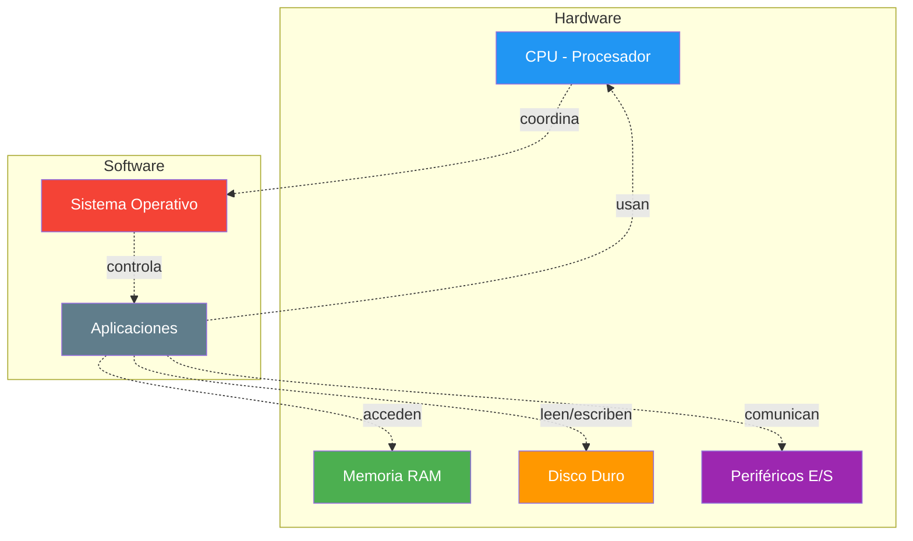
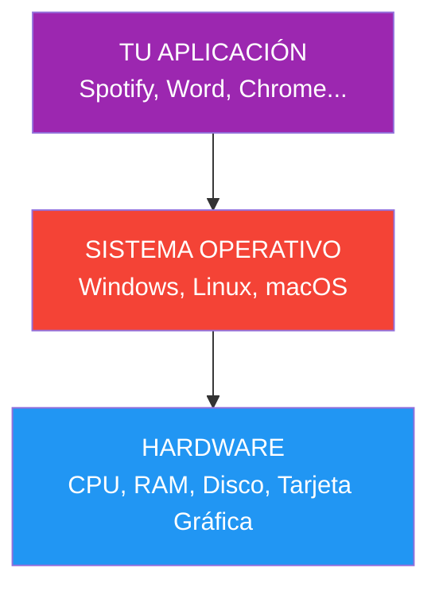

- [2. Conceptos Fundamentales: Software y Hardware](#2-conceptos-fundamentales-software-y-hardware)
  - [2.1. ¿Qué es el Software?](#21-qué-es-el-software)
    - [Tipos de Software](#tipos-de-software)
      - [Software de Sistema](#software-de-sistema)
      - [Software de Aplicación](#software-de-aplicación)
      - [Software de Desarrollo (o de Programación)](#software-de-desarrollo-o-de-programación)
    - [Tipos según personalización](#tipos-según-personalización)
      - [Software a medida](#software-a-medida)
      - [Software estándar](#software-estándar)
  - [2.2. ¿Qué es el Hardware?](#22-qué-es-el-hardware)
    - [La metáfora de la cocina](#la-metáfora-de-la-cocina)
  - [2.3. Relación Hardware-Software](#23-relación-hardware-software)
    - [Tabla comparativa: Software vs Hardware](#tabla-comparativa-software-vs-hardware)
    - [Desde el punto de vista del sistema operativo](#desde-el-punto-de-vista-del-sistema-operativo)
    - [Desde el punto de vista de las aplicaciones](#desde-el-punto-de-vista-de-las-aplicaciones)
    - [El puente hardware-software](#el-puente-hardware-software)

# 2. Conceptos Fundamentales: Software y Hardware

---

> 💡 **Punto de partida:** ¿Alguna vez te has preguntado por qué tu móvil funciona, mientras que un ladrillo del mismo tamaño no hace nada? La diferencia está en el software.

En el Punto 01 vimos qué es el desarrollo de software y sus fases. Ahora veremos qué es exactamente el software, qué es el hardware, y cómo se relacionan para que un ordenador funcione.

**Objetivos de aprendizaje:**

- Diferenciar entre software y hardware
- Identificar los componentes principales del sistema informático
- Comprender la relación entre software y hardware
- Reconocer los tipos de software según su función

---

## 2.1. ¿Qué es el Software?

El **software** es la parte intangible o lógica de un sistema informático. Es el conjunto de programas informáticos que actúan sobre el hardware para ejecutar lo que el usuario desee. Se desarrolla para llevar a cabo una tarea determinada, se comunica con el hardware y le indica qué hacer, y se encarga de traducir las instrucciones de los usuarios.

> 💡 **Analogía:** El hardware es como el cuerpo humano (órganos, huesos, músculos) y el software es como la mente y los pensamientos. Sin cuerpo no hay donde "vivir", pero sin mente no hay acciones ni decisiones.

### Tipos de Software

#### Software de Sistema
Es el software base que debe estar instalado y configurado en el ordenador para que las aplicaciones puedan ejecutarse y funcionar. Incluye el sistema operativo (como Windows, Linux, Mac OS X) y los *drivers* o controladores de dispositivos.

**Ejemplos en tu día a día:**
- Windows 11, macOS, Ubuntu Linux (Sistemas Operativos)
- Controladores de tu tarjeta gráfica NVIDIA/AMD
- Drivers de tu impresora HP o Canon

#### Software de Aplicación
Es un conjunto de programas que tienen una finalidad más o menos concreta. Ejemplos incluyen suites ofimáticas, navegadores, editores de imagen, procesadores de textos, hojas de cálculo, reproductores de música o videojuegos.

**Ejemplos:**
- Microsoft Word, Google Docs (procesamiento de textos)
- Excel, hojas de cálculo
- Chrome, Firefox, Edge (navegadores)
- Photoshop, GIMP (edición de imagen)
- Spotify, Netflix (entretenimiento)
- WhatsApp, Telegram (mensajería)

#### Software de Desarrollo (o de Programación)
Es el conjunto de herramientas que permiten desarrollar programas informáticos. Esto incluye editores, compiladores, intérpretes, entre otros.

**Herramientas que usarás en DAM:**
- Visual Studio Code, IntelliJ IDEA, Eclipse (editores/IDEs)
- GCC, Clang (compiladores de C/C++)
- Python interpreter
- Git (control de versiones)

### Tipos según personalización

#### Software a medida
Se desarrolla según las especificaciones o requerimientos de una empresa u organismo, adaptándose a su actividad específica. Necesita tiempo de desarrollo, se adapta a necesidades concretas, puede contener errores iniciales y suele ser más costoso.

**Ejemplos reales:**
- Sistema de gestión de inventarios para un supermercado específico
- Aplicación de citas médicas para un hospital
- Software de contabilidad adaptado a la legislación española

#### Software estándar
Es un software genérico válido para cualquier cliente potencial y resuelve múltiples necesidades, a menudo incluyendo herramientas de configuración. Se compra ya desarrollado, suele tener menos errores al ser más testeado y es más barato. Sin embargo, puede incluir funciones nunca usadas o carecer de opciones importantes.

**Ejemplos:**
- SAP (gestión empresarial)
- Salesforce (CRM)
- Microsoft Dynamics (ERP)

> 📝 **Nota:** En DAM vais a crear tanto software a medida (prácticas y proyectos) como a integrar soluciones estándar (usando APIs, conectando con bases de datos existentes, etc.). Ambos enfoques son valiosos en la industria.

---

## 2.2. ¿Qué es el Hardware?

El **hardware** es el conjunto de dispositivos físicos que conforman un ordenador. Los componentes principales del sistema informático incluyen:

- **CPU (Unidad Central de Procesamiento)**: También llamada UCP (en inglés), procesador o microprocesador. Lee y ejecuta las instrucciones almacenadas en la memoria RAM, así como los datos necesarios.
- **Memoria RAM**: Almacena de forma temporal el código binario de los archivos ejecutables y los archivos de datos necesarios para la ejecución del programa.
- **Disco Duro**: Almacena de forma permanente los archivos ejecutables y los archivos de datos. Se considera un periférico de Entrada/Salida (E/S).
- **Periféricos de Entrada/Salida (E/S)**: Recogen nuevos datos desde la entrada, muestran los resultados, leen o guardan datos en disco, etc.

### La metáfora de la cocina

| Componente | Analogía culinaria | Función |
|------------|-------------------|---------|
| CPU | Chef | Ejecuta las tareas, procesa la información |
| RAM | Encimera de trabajo | Espacio temporal para trabajar |
| Disco duro | Nevera/armario | Almacenamiento permanente |
| Periféricos E/S | Ventanilla de pedidos (entrada) y platos servidos (salida) | Comunicación con el usuario |

> 💡 **Consejo:** La CPU solo entiende código binario (0s y 1s). Cada instrucción que escribes en Java, Python o JavaScript se traduce eventualmente a millones de pulsos eléctricos que la CPU procesa a velocidades de miles de millones por segundo (gigahercios).

> ⚠️ **Advertencia:** No confundas "hardware" con "dispositivo físico" y "software" con "aplicación". El hardware incluye también componentes internos que nunca ves, y el software incluye sistemas operativos y drivers, no solo apps.

> 💡 **Reflexión:** Abre tu móvil. ¿Cuántos componentes de hardware identificas? (pantalla, batería, cámara, altavoz...) ¿Y cuántos de software? (sistema operativo, apps, fotos, contactos...)

---

## 2.3. Relación Hardware-Software

Existe una relación indisoluble entre hardware y software, ya que ambos necesitan estar instalados y configurados correctamente para que el equipo funcione. El software se ejecutará sobre los dispositivos físicos.

### Tabla comparativa: Software vs Hardware

| Característica | Software | Hardware |
|----------------|----------|----------|
| **Naturaleza** | Intangible (programas, datos) | Físico (dispositivos) |
| **Ejemplos** | Windows, Word, Chrome | CPU, RAM, disco duro |
| **Se deteriora** | No (se copia perfectamente) | Sí (se desgasta) |
| **Se puede robar** | Sí (copia ilegal) | Sí (robo físico) |
| **Depende de** | Hardware para ejecutarse | Software para funcionar |
| **Se mide en** | MB, GB, líneas de código | GHz, MB, TB |

Esta relación se manifiesta desde dos puntos de vista:

### Desde el punto de vista del sistema operativo

El **sistema operativo** es el encargado de coordinar el hardware durante el funcionamiento del ordenador, actuando como intermediario entre este y las aplicaciones que se están ejecutando. Todas las aplicaciones necesitan recursos hardware (tiempo de CPU, espacio en memoria RAM, tratamiento de interrupciones, gestión de dispositivos de E/S, etc.) durante su ejecución. El sistema operativo controla estos aspectos de manera "oculta" para las aplicaciones y el usuario.

> 📝 **Analogía:** El sistema operativo es como un director de orquesta. Los músicos (hardware) pueden tocar solos, pero necesitan al director (SO) para que todos toquen juntos, al mismo ritmo, y produzcan una sinfonía coherente.

**Funciones del Sistema Operativo:**
- Gestión de procesos (¿qué programa se ejecuta ahora?)
- Gestión de memoria (¿cuánta RAM usa cada programa?)
- Gestión de archivos (¿dónde se guardan los datos?)
- Gestión de dispositivos (¿cómo se comunica con la impresora?)
- Seguridad (¿quién puede acceder a qué?)

### Desde el punto de vista de las aplicaciones

Una aplicación es un conjunto de programas, escritos en algún lenguaje de programación. Mientras que los lenguajes de programación están diseñados para que los humanos puedan entenderlos y usarlos fácilmente, el hardware solo interpreta señales eléctricas (ausencias o presencias de tensión) que se traducen en secuencias de 0 y 1 (código binario). Esto implica que el código escrito en un lenguaje de programación debe pasar por un proceso de traducción para que el ordenador pueda entenderlo y ejecutarlo.

> 💡 **Dato curioso:** El código máquina de un procesador Intel i9 tiene más de 3.000 instrucciones diferentes. Cuando programas en Python o Java, estás usando abstracciones que ocultan esta complejidad.

### El puente hardware-software

> 📝 **Nota:** Esta separación entre hardware y software es lo que hace posible que puedas ejecutar el mismo programa (por ejemplo, Visual Studio Code) en Windows, Linux o macOS. El código es el mismo, pero el sistema operativo traduce tus órdenes a las señales específicas que entiende cada hardware.

> 💡 **Dato profesional:** En DAM, necesitarás entender esta relación para diagnosticar problemas en aplicaciones. Un error puede ser de software (bug en el código) o de hardware (falta de memoria, disco lleno).

---

**Resumen del punto:**

| Concepto | Descripción |
|----------|-------------|
| **Software** | Parte lógica: sistemas operativos, aplicaciones, herramientas de desarrollo |
| **Hardware** | Parte física: CPU, RAM, disco, periféricos |
| **Relación** | El software necesita hardware para ejecutarse; el hardware necesita software para funcionar |
| **SO** | Intermediario que gestiona los recursos hardware para las aplicaciones |

En el siguiente punto veremos el **ciclo de vida del desarrollo de software**, es decir, cómo se crea el software que se ejecuta en este hardware.
