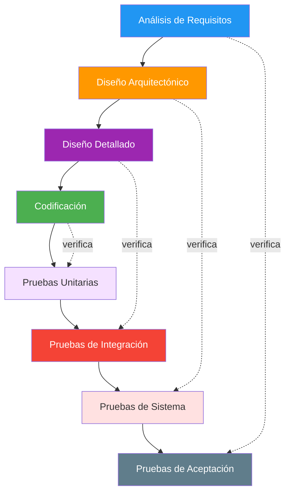
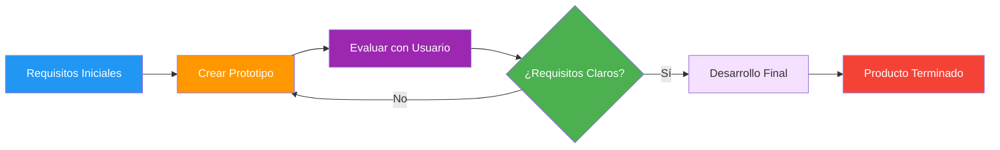
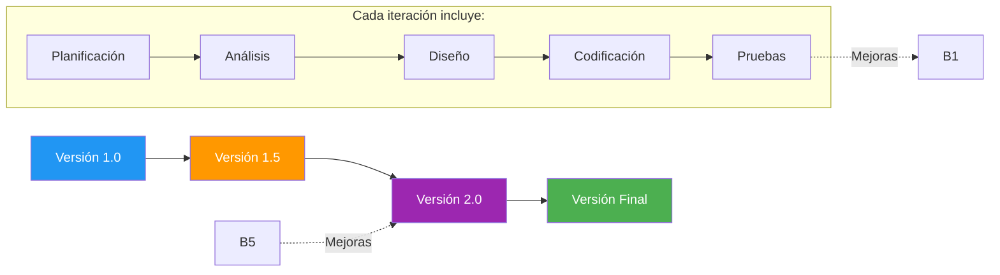
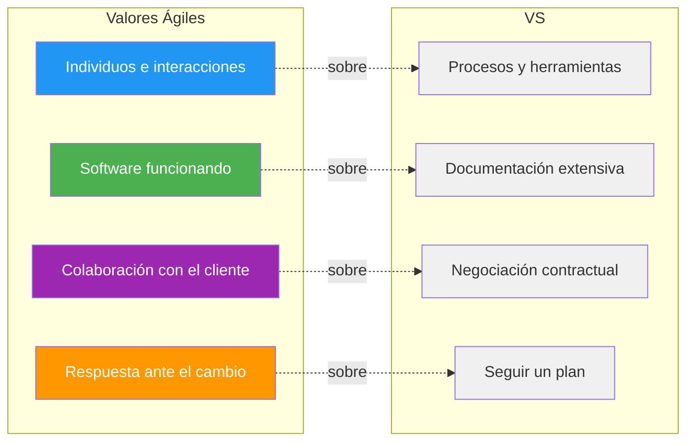
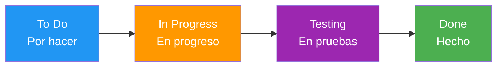
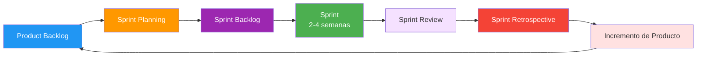
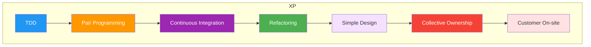

- [4. Modelos y Metodologías de Desarrollo de Software](#4-modelos-y-metodologías-de-desarrollo-de-software)
  - [4.1. Modelos Clásicos (Predictivos)](#41-modelos-clásicos-predictivos)
    - [4.1.1. Modelo en Cascada](#411-modelo-en-cascada)
    - [4.1.2. Modelo en V](#412-modelo-en-v)
  - [4.2. Modelo de Construcción de Prototipos](#42-modelo-de-construcción-de-prototipos)
    - [Tipos de Prototipos](#tipos-de-prototipos)
  - [4.3. Modelos Evolutivos o Incrementales](#43-modelos-evolutivos-o-incrementales)
    - [Variantes](#variantes)
  - [4.4. Metodologías Ágiles (Adaptativas)](#44-metodologías-ágiles-adaptativas)
    - [4.4.1. Manifiesto Ágil](#441-manifiesto-ágil)
    - [4.4.2. Kanban](#442-kanban)
    - [4.4.3. Scrum](#443-scrum)
    - [4.4.4. XP (eXtreme Programming)](#444-xp-extreme-programming)


# 4. Modelos y Metodologías de Desarrollo de Software

Siempre se debe aplicar un modelo de ciclo de vida al desarrollo de cualquier proyecto software. Estos modelos son la serie de pasos a seguir para desarrollar un programa.

> **💡 Analogía:** Elegir un modelo de desarrollo es como elegir el método de construcción de una casa. No es lo mismo construir una cabaña en el bosque (modelo simple, requisitos claros) que un rascacielos en el centro de una ciudad (modelo complejo, muchos cambios durante la construcción).

## 4.1. Modelos Clásicos (Predictivos)

Los modelos clásicos son más rígidos y presuponen que podemos conocer todos los requisitos al inicio del proyecto.

### 4.1.1. Modelo en Cascada

Es el modelo de desarrollo de software de mayor antigüedad. Identifica las fases principales del desarrollo de software y establece que las fases deben realizarse en el orden indicado, siendo el resultado de una fase la entrada de la siguiente. Es un modelo secuencial y lineal. Es un modelo bastante rígido que se adapta mal al cambio continuo de especificaciones. Es prácticamente imposible que se pueda utilizar, ya que requiere conocer de antemano todos los requisitos del sistema. Solo es aplicable a pequeños desarrollos, ya que las etapas pasan de una a otra sin retorno posible. Cualquier error detectado en una fase muy tardía implica sobrecoste y desperdicios.


**Casos de uso:**
- Proyectos pequeños con requisitos muy claros desde el inicio
- Sistemas críticos donde no se puede cambiar nada (regulación, seguridad)
- Construcción de bridges, sistemas embebidos con requisitos fijos

**Ejemplo histórico:** El desarrollo del sistema de control del Apollo 11 (llegada a la Luna en 1969) utilizó un enfoque similar al modelo en cascada, ya que no había margen para cambios una vez iniciado el proyecto.

> **⚠️ Inconveniente principal:** Si en la fase de análisis te equivocas y lo descubres en fase de pruebas, tienes que volver atrás Y RECODIFICAR TODO. Esto multiplica costes.

#### Modelo en Cascada con Realimentación

Es una variante del modelo en cascada que introduce una realimentación entre etapas. Esto permite volver atrás en cualquier momento para corregir, modificar o depurar algún aspecto. Es el modelo perfecto si el proyecto es rígido (pocos cambios, poco evolutivo) y los requisitos están claros, aunque no es el más idóneo si se prevén muchos cambios.

**Ventaja:** Permite correcciones sin empezar desde cero
**Desventaja:** Cada "vuelta atrás" cuesta tiempo y dinero


### 4.1.2. Modelo en V

Es un modelo muy parecido al modelo en cascada. Presenta una visión jerarquizada con distintos niveles, donde los superiores indican mayor abstracción y los inferiores mayor nivel de detalle. El resultado de una fase es la entrada de la siguiente.



**Característica distintiva:** Cada fase de desarrollo tiene una fase de verificación correspondiente.

| Fase de Desarrollo | Fase de Verificación |
|-------------------|---------------------|
| Análisis | Pruebas de aceptación |
| Diseño arquitectónico | Pruebas de sistema |
| Diseño detallado | Pruebas de integración |
| Codificación | Pruebas unitarias |

**Casos de uso:**
- Sistemas críticos donde cada fase debe ser verificada antes de avanzar
- Industria aeroespacial, médica, nuclear
- Proyectos con altos requisitos de calidad y seguridad

> **📝 Nota del Profesor:** En DAM trabajaremos principalmente con modelos ágiles, pero es importante que conozcáis los modelos clásicos porque muchas empresas (especialmente en sectores regulados) todavía los usan.


## 4.2. Modelo de Construcción de Prototipos

Se utiliza a menudo cuando los requisitos no están especificados claramente, ya sea por falta de experiencia previa o por omisión/falta de concreción del usuario/cliente. El proceso implica crear un prototipo durante la fase de análisis, que es probado por el usuario/cliente para refinar los requisitos del software a desarrollar. Este paso se repite las veces necesarias.

> **💡 Analogía:** Es como dibujar varios bocetos de un logo antes de quedarse con el definitivo. Cada prototipo "refina" lo que el cliente realmente quiere.

### Tipos de Prototipos

- **Prototipos rápidos (Throwaway/Rapid)**: El prototipo puede desarrollarse usando otro lenguaje o herramientas y finalmente se desecha. Su único propósito es validar requisitos.

  *Ejemplo:* Crear una maqueta en Figma o Adobe XD para mostrar al cliente cómo ficará la interfaz, sin programar nada funcional.

- **Prototipos evolutivos (Evolutionary)**: El prototipo está diseñado en el mismo lenguaje y herramientas del proyecto y se usa como base para desarrollar el proyecto.

  *Ejemplo:* Crear una versión mínima viable (MVP) de una app, mejorarla con feedback del usuario, y gradualmente convertirla en el producto final.



**Ventajas:**
- Reduce el riesgo de malinterpretar requisitos
- El cliente ve resultados rápidamente
- Facilita la comunicación cliente-desarrollador

**Desventajas:**
- El cliente puede confundirse pensando que el prototipo ES el producto final
- Prototipos "desechables" pueden contener código que alguien decide reutilizar (mala idea)


## 4.3. Modelos Evolutivos o Incrementales

Son modelos más modernos que los clásicos y tienen en cuenta la naturaleza cambiante y evolutiva del software. La idea es desarrollar una implementación inicial del sistema, exponerla a los comentarios del usuario y refinarla en sucesivas versiones hasta obtener el sistema adecuado. Permiten una rápida realimentación del usuario, ya que las actividades de especificación, desarrollo y pruebas se ejecutan en cada iteración.

### Variantes

#### Modelo Iterativo Incremental

Está basado en el modelo en cascada con realimentación, donde las fases se repiten y refinan, propagando su mejora a las fases siguientes.

```
Iteración 1: Versión 1.0 (funcionalidad básica)
    ↓ Se добавляет feedback
Iteración 2: Versión 1.1 (mejoras)
    ↓ Se добавляет feedback
Iteración 3: Versión 2.0 (más funcionalidades)
    ↓ ...
Versión Final: Producto completo y refinado
```

#### Modelo en Espiral

Desarrollado por Boehm en 1988, es una combinación del modelo iterativo incremental con el modelo en cascada. El software se construye repetidamente en forma de versiones que son cada vez mejores, incrementando la funcionalidad en cada versión. Este modelo también se centra en la gestión de riesgos en cada fase del proceso de desarrollo. Es un modelo bastante complejo.



Las cuatro fases principales del modelo en espiral son:

1. **Determinación de objetivos**: Identificar objetivos para la iteración actual (nuevas características, mejoras, corrección de errores).
2. **Análisis de riesgos**: Identificar y evaluar riesgos potenciales (técnicos, de gestión).
3. **Desarrollo y validación**: Desarrollar y probar el software, incluyendo prototipos e implementación.
4. **Planificación**: Revisar el proyecto y planificar la próxima iteración.

> **💡 Dato histórico:** El modelo en espiral fue propuesto por Barry Boehm en 1986 como respuesta a las limitaciones del modelo en cascada. Es uno de los primeros modelos en formalizar la gestión de riesgos.

**Casos de uso:**
- Proyectos grandes con alta incertidumbre
- Sistemas donde los requisitos pueden cambiar frecuentemente
- Innovación y desarrollo de nuevos productos


## 4.4. Metodologías Ágiles (Adaptativas)

Las **metodologías ágiles** son un conjunto de metodologías de desarrollo de software basadas en el desarrollo iterativo e incremental. Los requisitos y soluciones evolucionan con el tiempo según la necesidad del proyecto. Promueven el trabajo en equipo, la colaboración con el cliente y la adaptación al cambio. Los equipos se autoorganizan y son multidisciplinares, inmersos en un proceso compartido de toma de decisiones a corto plazo.

### 4.4.1. Manifiesto Ágil

Todos los equipos de desarrollo ágil deben seguir los cuatro valores y los doce principios del Manifiesto Ágil, creados en 2001 por 17 desarrolladores frustrados con la rigidez de los métodos tradicionales.

Los cuatro valores son:

- **Individuos e interacciones** sobre procesos y herramientas.
- **Software funcionando** sobre documentación extensiva.
- **Colaboración con el cliente** sobre negociación contractual.
- **Respuesta ante el cambio** sobre seguir un plan.



> **💡 Nota importante:** Los valores ágiles NO dicen que los procesos, la documentación, los contratos y los planes sean inútiles. Dicen que los individuos, el software funcionando, la colaboración y la respuesta al cambio son MÁS VALOROSOS.

### 4.4.2. Kanban

También conocido como "sistema de tarjetas", fue desarrollado inicialmente por Toyota para la industria de fabricación de productos. Controla por demanda la fabricación de los productos necesarios en la cantidad y tiempo justos. Está enfocado a entregar el máximo valor para los clientes, utilizando los recursos justos. Se basa en el *Lean manufacturing*.



**Principios del Kanban:**
1. **Visualizar el trabajo**: Usar un tablero con columnas
2. **Limitar el trabajo en progreso (WIP)**: No startar múltiples tareas a la vez
3. **Gestionar el flujo**: Optimizar cómo el trabajo avanza
4. **Hacer políticas explícitas**: Reglas claras para todos
5. **Implementar ciclos de feedback**: Revisiones regulares
6. **Mejorar colaborativamente**: Evolución continua

**Herramientas que usan Kanban:**
- Trello, Jira, Asana, Notion, Microsoft Planner

**Ejemplo de tablero Kanban:**

| To Do | In Progress | Testing | Done |
|-------|-------------|---------|------|
| - Login con Google | - Pantalla principal | - Carrito | - Registro |
| - Filtros búsqueda | - Panel admin | - Checkout | - Base datos |
| - Notificaciones | | | |


### 4.4.3. Scrum

Es un modelo de desarrollo incremental que se ha convertido en el estándar de la industria. Utiliza **iteraciones (sprint)** regulares, que suelen durar entre 2 y 4 semanas. Al principio de cada iteración se establecen sus **objetivos priorizados (sprint backlog)**. Al finalizar cada iteración se obtiene una **entrega parcial utilizable por el cliente**. Existen reuniones diarias para tratar la marcha del *sprint*.



**Roles en Scrum:**

| Rol | Responsabilidad |
|-----|-----------------|
| **Product Owner** | Dueño del producto, prioriza el backlog |
| **Scrum Master** | Facilita el proceso, elimina obstáculos |
| **Team** | Desarrolladores multidisciplinares |

**Eventos en Scrum:**

| Evento | Duración típica | Propósito |
|--------|-----------------|-----------|
| Sprint | 2-4 semanas | Iteración de trabajo |
| Daily Standup | 15 min | Sincronización diaria |
| Sprint Planning | 2-4 horas | Planificar el sprint |
| Sprint Review | 1-2 horas | Demostrar resultados |
| Retrospective | 1-2 horas | Mejorar el proceso |

**Artefactos de Scrum:**

- **Product Backlog**: Lista priorizada de funcionalidades
- **Sprint Backlog**: Tareas del sprint actual
- **Incremento**: Producto usable al final del sprint

> **📝 Nota del Profesor:** En DAM vamos a practicar Scrum con sprints de 2 semanas. Tendréis roles de Product Owner, Scrum Master y equipo de desarrollo. Es una experiencia muy valiosa para el mercado laboral.


### 4.4.4. XP (eXtreme Programming)

Es una metodología ágil que enfatiza la calidad del código y la satisfacción del cliente. Se basa en los siguientes **valores**:

- **Simplicidad**: Escribir el código más simple que funcione
- **Comunicación**: Todos hablan con todos constantemente
- **Retroalimentación**: Feedback rápido y constante
- **Valentía o coraje**:勇气承认错误并改正
- **Respeto o humildad**:尊重团队成员

Sus **características** incluyen:

- **Diseño sencillo**: No anticipar necesidades futuras
- **Pequeñas mejoras continuas**: Refactorización constante
- **Pruebas y refactorización**: Tests primero (TDD)
- **Integración continua**: Subir código varias veces al día
- **Programación por parejas (Pair Programming)**: Dos personas en un ordenador
- **El cliente se integra en el equipo de desarrollo**: El cliente está presente
- **Propiedad del código compartida**: Cualquiera puede modificar cualquier código
- **Estándares de codificación**: Todos escriben igual
- **Trabajo de 40 horas semanales**: No hacer horas extra crónicamente



**TDD (Test-Driven Development):**
1. Escribir un test que falle
2. Escribir código mínimo para pasar el test
3. Refactorizar para mejorar

> **💡 Dato curioso:** XP fue creado por Kent Beck en 1996 mientras trabajaba en el proyecto Chrysler Comprehensive Compensation System. Beck escribió el libro "Extreme Programming Explained" en 1999.

**Cuándo usar XP:**
- Requisitos que cambian frecuentemente
- Equipos pequeños-medios (2-10 personas)
- Proyectos con alta incertidumbre técnica
- Cuando la calidad del código es crítica


### Comparativa de Metodologías

| Aspecto | Cascada | Scrum | Kanban | XP |
|---------|---------|-------|--------|-----|
| Iteraciones | No | Sí (sprints) | Continuo | Sí |
| Roles definidos | Sí | 3 roles | No | Sí |
| Duración fija | No | 2-4 semanas | Variable | Iteraciones cortas |
| Cambios | Difíciles | Bienvenidos | Bienvenidos | Bienvenidos |
| Documentación | Extensiva | Mínima necesaria | Mínima necesaria | Mínima necesaria |
| Testing | Al final | Continuo | Continuo | Central (TDD) |
| Mejor para | Requisitos fijos | Gestión de producto | Flujo continuo | Calidad de código |
