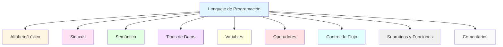
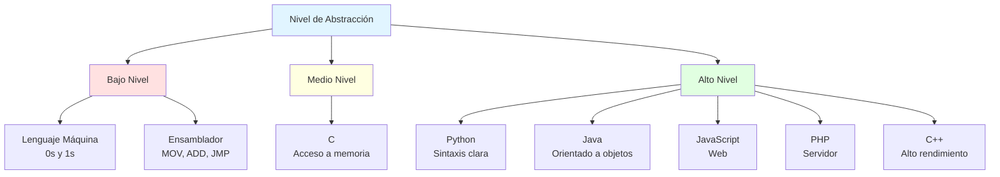
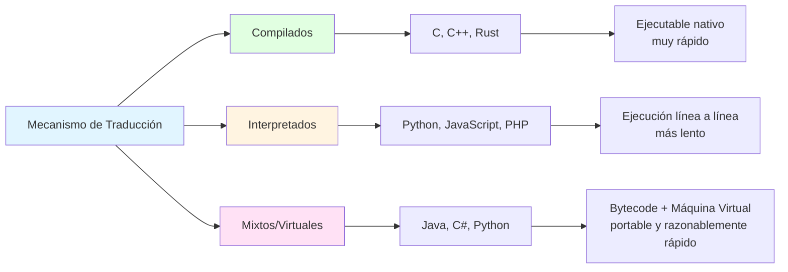
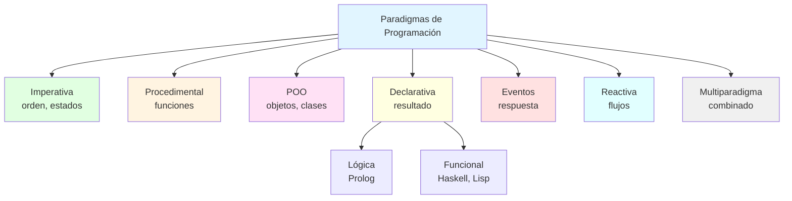
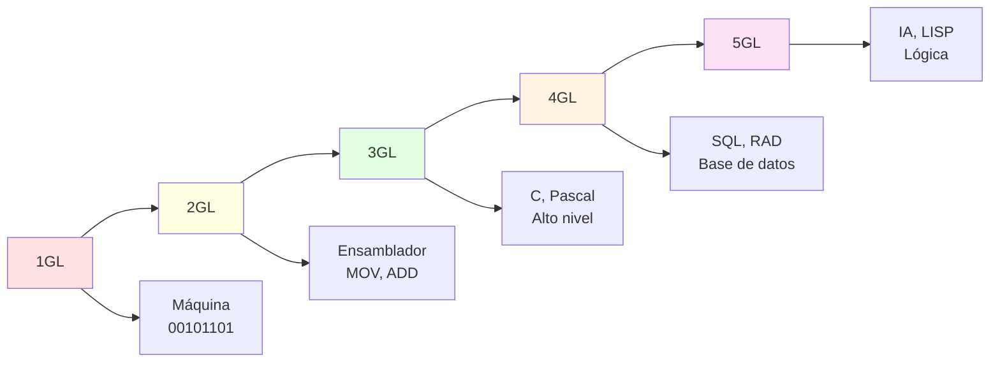

- [5. Lenguajes de Programación](#5-lenguajes-de-programación)
  - [5.1. ¿Qué es un Lenguaje de Programación?](#51-qué-es-un-lenguaje-de-programación)
    - [Elementos que componen un lenguaje de programación](#elementos-que-componen-un-lenguaje-de-programación)
    - [Otros elementos importantes](#otros-elementos-importantes)
  - [5.2. Clasificación de Lenguajes de Programación](#52-clasificación-de-lenguajes-de-programación)
    - [5.2.1. Según su cercanía al lenguaje humano (Nivel de Abstracción)](#521-según-su-cercanía-al-lenguaje-humano-nivel-de-abstracción)
      - [Lenguajes de Bajo Nivel](#lenguajes-de-bajo-nivel)
      - [Lenguajes de Medio Nivel](#lenguajes-de-medio-nivel)
      - [Lenguajes de Alto Nivel](#lenguajes-de-alto-nivel)
    - [5.2.2. Según su mecanismo de traducción (Compilados, Interpretados, Mixtos)](#522-según-su-mecanismo-de-traducción-compilados-interpretados-mixtos)
      - [Lenguajes Compilados](#lenguajes-compilados)
      - [Lenguajes Interpretados](#lenguajes-interpretados)
      - [Lenguajes Mixtos o Virtuales](#lenguajes-mixtos-o-virtuales)
    - [5.2.3. Según su sistema de tipos (Tipado Fuerte, Tipado Débil)](#523-según-su-sistema-de-tipos-tipado-fuerte-tipado-débil)
      - [Rigidez: Tipado Fuerte vs. Tipado Débil](#rigidez-tipado-fuerte-vs-tipado-débil)
      - [Momento de Verificación: Tipado Estático vs. Tipado Dinámico](#momento-de-verificación-tipado-estático-vs-tipado-dinámico)
      - [Declaración: Tipado Explícito vs. Implícito (Inferencia)](#declaración-tipado-explícito-vs-implícito-inferencia)
      - [Lenguajes sin Tipado (Tipado Nulo)](#lenguajes-sin-tipado-tipado-nulo)
      - [Tabla Resumen de Sistemas de Tipado](#tabla-resumen-de-sistemas-de-tipado)
    - [5.2.4. Según la forma en que operan (Paradigmas de Programación)](#524-según-la-forma-en-que-operan-paradigmas-de-programación)
    - [Principales Paradigmas](#principales-paradigmas)
    - [5.2.5. Según Generaciones](#525-según-generaciones)
  - [5.3. Criterios para la Selección de un Lenguaje de Programación](#53-criterios-para-la-selección-de-un-lenguaje-de-programación)
  - [5.4. Lenguajes más Utilizados en la Actualidad](#54-lenguajes-más-utilizados-en-la-actualidad)


# 5. Lenguajes de Programación

## 5.1. ¿Qué es un Lenguaje de Programación?

Un **lenguaje de programación** es un idioma creado de forma artificial, formado por un conjunto de símbolos y normas que se aplican sobre un alfabeto para obtener un código que el hardware de la computadora pueda entender y ejecutar. Son los instrumentos que tenemos para que el ordenador realice las tareas que necesitamos. Es un lenguaje formal que proporciona un conjunto de instrucciones que permiten a un programador escribir secuencias de comandos, que son interpretadas por una máquina, para producir un comportamiento deseado.

> **💡 Analogía:** Un lenguaje de programación es como un puente entre tu mente (donde tienes ideas) y el ordenador (que solo entiende 0s y 1s). Sin ese puente, no hay comunicación posible.

### Elementos que componen un lenguaje de programación

- **Alfabeto (Léxico)**: Es el conjunto finito de símbolos permitidos y palabras especiales, el vocabulario del lenguaje.
- **Sintaxis**: Son las normas de construcción permitidas de los símbolos y palabras del lenguaje. Se refiere a las reglas que rigen la estructura de las declaraciones y expresiones válidas.
- **Semántica**: Es el significado de las construcciones. Define las acciones que se llevarán a cabo con las combinaciones de los símbolos.

**Ejemplo de los tres componentes:**

```python
# Léxico: palabras como 'def', 'print', 'hola'
# Sintaxis: estructura 'def nombre():' seguida de indentación
# Semántica: lo que ocurre cuando se ejecuta la función

def saludar(nombre):
    print(f"Hola, {nombre}!")
```

> **📝 Nota del Profesor:** La sintaxis es como la gramática de un idioma. Si dices "Yo hambre tengo" en español, se entiende pero no es语法 correcto. Lo mismo pasa en programación: `if (x > 5` sin cerrar el paréntesis causa error de sintaxis.

### Otros elementos importantes

- **Tipos de Datos**: Los diferentes tipos de valores que pueden ser representados y manipulados (enteros, flotantes, caracteres, cadenas, booleanos). Definen el conjunto de valores válidos y las operaciones permitidas para ellos, así como el **espacio de memoria** que ocupan.
- **Variables**: Símbolos que representan valores en el programa y tienen tipos asociados.
- **Operadores**: Símbolos que representan operaciones específicas (por ejemplo, `+` para adición, `==` para comparación).
- **Control de Flujo**: Estructuras que determinan el orden de ejecución de las instrucciones (condicionales como `if`, `switch`; bucles como `for`, `while`).
- **Subrutinas y Funciones**: Bloques de código que pueden ser definidos y llamados por nombre, permitiendo la reutilización y modularidad.
- **Comentarios**: Notas que los programadores dejan en el código para explicar su funcionamiento, no son ejecutados.



**Analogía del código:**
| Elemento | Analogía |
|----------|----------|
| Léxico | Palabras del diccionario |
| Sintaxis | Reglas gramaticales |
| Semántica | Significado de las oraciones |
| Variables | Cajas donde guardamos cosas |
| Tipos de datos | Tipo de cosa en la caja |
| Operadores | Acciones (+, -, *, /) |
| Control de flujo | Direcciones de tráfico |
| Funciones | Recetas de cocina reutilizables |


## 5.2. Clasificación de Lenguajes de Programación

Los lenguajes se pueden clasificar de muchas formas. Las más importantes para DAM son:

### 5.2.1. Según su cercanía al lenguaje humano (Nivel de Abstracción)

Los lenguajes han evolucionado siempre hacia una mayor usabilidad y cercanía al razonamiento humano.

#### Lenguajes de Bajo Nivel

Son lenguajes totalmente dependientes de la máquina, lo que significa que un programa desarrollado en ellos no puede ser migrado o utilizado en otras máquinas. Aprovechan al máximo las características del hardware.

- **Lenguaje Máquina**: Sus instrucciones son combinaciones de unos y ceros (código binario). Es el único lenguaje que el ordenador entiende directamente (no necesita traducción). Fue el primer lenguaje utilizado y es único para cada procesador (no portable). Es rápido, pero difícil de manejar, con códigos fuente enormes y detección de fallos casi imposible. Hoy día nadie programa en este lenguaje.

  **Ejemplo de código máquina (x86):**
  ```
  10110000 01100111  (mov al, 01100111b)
  10110011 00000001  (mov bl, 00000001b)
  00000010 11011000  (add al, bl)
  ```

- **Lenguaje Ensamblador**: Sustituyó al lenguaje máquina, utilizando mnemotécnicos (instrucciones complejas) en lugar de unos y ceros. Necesita traducción al lenguaje máquina para ejecutarse. Sus instrucciones hacen referencia a la ubicación física de los archivos en el equipo. Es difícil de utilizar. Como ventaja frente al código máquina, los códigos fuente eran más cortos y ocupaban menos memoria.

  **Ejemplo de ensamblador x86:**
  ```asm
  MOV AX, 5      ; Mover el valor 5 al registro AX
  MOV BX, 3      ; Mover el valor 3 al registro BX
  ADD AX, BX     ; Sumar AX + BX
  ```

#### Lenguajes de Medio Nivel

Este término no es universalmente aceptado, pero se refiere a lenguajes que se encuentran en un punto medio. Pueden acceder a los registros del sistema y trabajar con direcciones de memoria (características de bajo nivel), y a la vez realizar operaciones de alto nivel. Un ejemplo es C.

**Ejemplo en C:**
```c
#include <stdio.h>

int main() {
    int numero = 42;
    printf("El número es: %d\n", numero);
    return 0;
}
```

#### Lenguajes de Alto Nivel

Se encuentran más cercanos al lenguaje natural que al lenguaje máquina, y son independientes de la arquitectura del ordenador. Permiten al programador olvidarse del funcionamiento interno de la máquina. Utilizan sentencias y órdenes derivadas del idioma inglés. Necesitan un traductor para ser entendidos por la máquina. Incorporan librerías y funciones predeterminadas, y suelen ofrecer *frameworks*. La mayoría de los lenguajes de programación actuales seengloban en esta categoría. Ejemplos incluyen C++, Java, Python, JavaScript, PHP.

**Ejemplo en Python:**
```python
numero = 42
print(f"El número es: {numero}")
```



> **📝 Dato curioso:** El primer lenguaje de alto nivel fue Fortran (1957), creado por John Backus en IBM. Permitía escribir fórmulas matemáticas de forma casi natural. Fortran todavía se usa hoy en cálculos científicos de alto rendimiento.


### 5.2.2. Según su mecanismo de traducción (Compilados, Interpretados, Mixtos)

La obtención de código binario ejecutable se realiza mediante compilación o interpretación.

#### Lenguajes Compilados

Necesitan un **compilador** que traduce el código fuente a código binario (código objeto) en un solo paso. Se ejecutan muy eficientemente. La principal desventaja es que es necesario compilar cada vez que el código fuente es modificado. Precisan de un programa enlazador (*linker*) que une el código objeto con el código objeto de librerías. El código es más seguro, ya que el código fuente no es directamente accesible. Ejemplos incluyen C y C++.

**Proceso:**
```
Código Fuente (.c) → Compilador → Código Objeto (.o) → Enlazador → Ejecutable (.exe)
```

**Ventajas:**
- Ejecución muy rápida (optimizado para el hardware)
- Código fuente protegido (no se distribuye)

**Desventajas:**
- Platforma-dependiente (compilar para Windows ≠ para Linux)
- Cada修改 requiere recompilar

#### Lenguajes Interpretados

No generan código objeto. El código fuente se interpreta directamente, línea a línea, y se ejecuta simultáneamente. Esto se realiza mediante un programa auxiliar llamado **intérprete**, que debe estar cargado en memoria. La ejecución es menos eficiente que los compilados. La ventaja es que el código fuente se interpreta directamente sin un paso de compilación explícito a código objeto. La detección de errores es más detallada. La principal desventaja es que el código fuente es legible, lo que puede comprometer la seguridad o los derechos de autor. Ejemplos incluyen PHP y JavaScript.

**Proceso:**
```
Código Fuente (.js) → Intérprete → Ejecución directa línea a línea
```

**Ventajas:**
- Multiplataforma (el intérprete existe en cada SO)
- Desarrollo rápido (no esperar a compilar)
- Depuración fácil (error en la línea exacta)

**Desventajas:**
- Ejecución más lenta
- Código fuente visible (problemas de seguridad)

#### Lenguajes Mixtos o Virtuales

Combinan características de ambos. El código fuente se compila a un código binario intermedio denominado **bytecode**. Este bytecode puede considerarse código objeto, pero está destinado a una **máquina virtual** en lugar de a código objeto nativo. Luego, este bytecode se interpreta para ejecutarlo en cualquier máquina virtual compatible. Son más portables que los lenguajes compilados. El objetivo es compilar una vez y ejecutar en distintos sistemas. Ejemplos incluyen Java, C# o Python.

**Proceso:**
```
Código Fuente (.java) → Compilador → Bytecode (.class) → JVM → Ejecución
```

> **💡 Ejemplo real:** Cuando descargas una app de Android, no descargas código Java, sino bytecode (.dex) que la Dalvik/ART VM ejecuta. Esto permite que la misma app funcione en cualquier dispositivo Android.




### 5.2.3. Según su sistema de tipos (Tipado Fuerte, Tipado Débil)

Un **tipo de dato** es una clasificación que define el conjunto de valores que una variable puede tomar y las operaciones válidas que se pueden realizar sobre esos valores. Esta clasificación es fundamental porque **determina la cantidad de memoria que el sistema operativo debe reservar** para la variable. Por ejemplo, una variable de tipo `int` ocupará menos espacio que una de tipo `float` porque su rango de valores es menor.

El **sistema de tipos** de un lenguaje de programación es un conjunto de reglas que definen cómo se manejan y verifican estos tipos de datos. La clasificación de estos sistemas se basa en tres dimensiones principales: la rigidez, el momento de verificación y la declaración.

#### Rigidez: Tipado Fuerte vs. Tipado Débil

Esta dimensión se refiere a la flexibilidad con la que un lenguaje maneja las conversiones entre tipos de datos.

- **Lenguajes de Tipado Fuerte**: Requieren que los tipos de datos sean compatibles para realizar operaciones. No permiten conversiones automáticas o "implícitas" entre tipos no relacionados. Si intentas sumar un número y una cadena de texto, el lenguaje lo marcará como un error, lo que previene errores inesperados en tiempo de ejecución y hace el código más robusto.
  - **Ejemplos**: Python, Java, C#, Ruby.

  ```python
  # Python (tipado fuerte)
  resultado = "5" + 3  # TypeError: can only concatenate str to str
  ```

- **Lenguajes de Tipado Débil**: Permiten conversiones de tipo automáticas. El lenguaje puede intentar convertir un tipo de dato a otro sin que el programador lo solicite explícitamente. Esta flexibilidad puede llevar a errores que son difíciles de detectar.
  - **Ejemplos**: JavaScript, PHP, VBScript.

  ```javascript
  // JavaScript (tipado débil)
  resultado = "5" + 3  // "53" (convierte 3 a string)
  resultado = "5" - 3  // 2 (convierte "5" a número)
  ```

#### Momento de Verificación: Tipado Estático vs. Tipado Dinámico

Esta dimensión se basa en el momento en que se realiza la verificación de los tipos de datos.

- **Lenguajes de Tipado Estático**: La verificación de tipos se realiza en **tiempo de compilación**. El tipo de cada variable debe ser conocido y, a menudo, declarado explícitamente antes de ejecutar el programa. Si hay un error de tipo, el programa no compilará. Esto garantiza mayor seguridad y rendimiento.
  - **Ejemplos**: C++, Java, C#, Swift, TypeScript.

  ```java
  // Java (tipado estático)
  int numero = 42;      // Declaramos tipo explícito
  String texto = "hola";
  // numero = "texto"; // Error de compilación
  ```

- **Lenguajes de Tipado Dinámico**: La verificación de tipos se realiza en **tiempo de ejecución**. No es necesario declarar el tipo de una variable de forma explícita; el intérprete lo determina automáticamente. Una misma variable puede cambiar de tipo durante la ejecución. Esto ofrece gran flexibilidad, pero los errores de tipo solo se descubren al ejecutar el código.
  - **Ejemplos**: Python, JavaScript, Ruby, PHP.

  ```python
  # Python (tipado dinámico)
  variable = 42         # int
  variable = "texto"    # ahora es str
  variable = [1, 2, 3]  # ahora es list
  # Funciona, pero cuidado con los bugs!
  ```

#### Declaración: Tipado Explícito vs. Implícito (Inferencia)

Esta dimensión se refiere a la forma en que el programador indica el tipo de una variable.

- **Tipado Explícito**: Requiere que el programador declare manualmente el tipo de cada variable. Esto hace el código más claro y fácil de leer, ya que el tipo está siempre a la vista.
  - **Ejemplo**: En C++: `int numero = 10;`.

- **Tipado Implícito (Inferencia de Tipos)**: El compilador o intérprete infiere el tipo de la variable a partir del valor asignado, sin que el programador tenga que declararlo. Esta característica hace que el código sea más conciso y rápido de escribir. La inferencia de tipos es muy común en lenguajes con tipado estático modernos.
  - **Ejemplo**: En Python: `numero = 10;` (el intérprete infiere que `numero` es de tipo `int`).
  - **Ejemplo en Kotlin**: `val numero = 10` (infiere Int)
  - **Ejemplo en TypeScript**: `let numero = 10` (infiere number)

#### Lenguajes sin Tipado (Tipado Nulo)

En algunos lenguajes de muy bajo nivel, como el **lenguaje de ensamblador**, no existe un sistema de tipos formal. Todas las variables se manejan como una simple secuencia de bits, y es responsabilidad total del programador interpretar los datos.

#### Tabla Resumen de Sistemas de Tipado

La combinación de estas tres dimensiones define el sistema de tipos de un lenguaje.

| Sistema de Tipado | Descripción | Ejemplos de Lenguajes |
| :---------------- | :----------------------------------------------------------- | :-------------------- |
| **Estático y Fuerte** | Tipos verificados en compilación; no hay conversiones implícitas. | C++, Java, C#, Swift, Kotlin |
| **Dinámico y Fuerte** | Tipos verificados en ejecución; no hay conversiones implícitas. | Python, Ruby, Haskell |
| **Estático y Débil** | Tipos verificados en compilación; sí hay conversiones implícitas. | C (algunas operaciones), VBScript |
| **Dinámico y Débil** | Tipos verificados en ejecución; sí hay conversiones implícitas. | JavaScript, PHP, Perl |

```mermaid
graph TB
    A[Sistema de Tipos] --> B[Rigidez]
    A --> C[Momento de Verificación]
    A --> D[Declaración]

    B --> B1[Tipado Fuerte<br/>Python, Java]
    B --> B2[Tipado Débil<br/>JavaScript, PHP]

    C --> C1[Tipado Estático<br/>verificación en compilación]
    C --> C2[Tipado Dinámico<br/>verificación en ejecución]

    D --> D1[Tipado Explícito<br/>int x = 5]
    D --> D2[Tipado Implícito<br/>x = 5 (infiere)]

    style A fill:#e1f5ff
    style B fill:#e1ffe1
    style C fill:#fff4e1
    style D fill:#ffe1f5
```

> **📝 Nota del Profesor:** No existe un "mejor" sistema de tipos. El tipado fuerte y estático (Java, C#) detecta errores antes pero requiere más código. El tipado dinámico (Python, JavaScript) es más rápido de escribir pero puede ocultar errores hasta producción. Elegid según el contexto del proyecto.

### 5.2.4. Según la forma en que operan (Paradigmas de Programación)

Un **paradigma de programación** es un modelo fundamental para el diseño y la implementación de programas, que determina la estructura y el enfoque del código. La mayoría de los lenguajes de programación modernos, como **Java**, **Kotlin** y **C#**, son multiparadigma, lo que significa que combinan características de varios de ellos para ofrecer mayor flexibilidad y poder a los desarrolladores.

### Principales Paradigmas

- **Programación Imperativa/Estructurada**: Se basa en una serie de comandos que la computadora ejecuta en orden para cambiar el estado del programa. Es un enfoque muy directo y se basa en tres estructuras principales: sentencias secuenciales, selectivas (condicionales) y repetitivas (bucles). Es fácil de entender para programas sencillos, pero puede volverse difícil de manejar en proyectos grandes, ya que todo el código se concentra en un solo bloque. Ejemplos: C, Pascal.

  ```c
  // Programación estructurada en C
  int main() {
      int i, suma = 0;
      for (i = 1; i <= 10; i++) {  // Bucle (repetitiva)
          if (i % 2 == 0) {         // Condicional (selectiva)
              suma += i;             // Secuencial
          }
      }
      return 0;
  }
  ```

- **Programación Procedimental**: Es un subtipo del paradigma imperativo. Aquí, los programas se organizan en **procedimientos** (o funciones) que manipulan el estado global del programa. Se relaciona estrechamente con la programación estructurada y modular. C, Visual Basic, y otros lenguajes permiten este estilo de programación al escribir funciones o métodos que no están necesariamente asociados a una clase.

- **Programación Orientada a Objetos (POO)**: En este paradigma, los programas se construyen como una colección de **objetos** que interactúan entre sí. Un objeto es una instancia de una **clase** que contiene datos (atributos) y los métodos para operar sobre ellos. La POO promueve la reutilización de código, facilita la depuración y mejora el mantenimiento a largo plazo. Sus pilares son el **polimorfismo**, la **herencia** y la **encapsulación**. Ejemplos: C++, Python, Java, Kotlin, C#.

  ```python
  # POO en Python
  class Coche:
      def __init__(self, marca, modelo):
          self.marca = marca          # Atributo
          self.modelo = modelo        # Atributo
      
      def arrancar(self):             # Método
          print(f"{self.marca} {self.modelo} arrancado")
  
  mi_coche = Coche("Toyota", "Corolla")  # Objeto
  mi_coche.arrancar()                     # Llamada a método
  ```

- **Programación Declarativa**: Los programas describen el **resultado deseado**, no el proceso paso a paso para lograrlo. Suelen ser lenguajes interpretados.

  - **Lógica**: Utiliza reglas y afirmaciones de lógica formal para que la computadora deduzca la respuesta a una consulta. Se usa mucho en inteligencia artificial. Ejemplo: Prolog.
  - **Funcional**: Se enfoca en el uso de **funciones matemáticas** que no cambian el estado ni los datos externos. Esto resulta en un código modular y estructurado, aunque puede volverse complejo. Java a partir de la versión 8 (con expresiones lambda y la API Streams) y C# (con LINQ y expresiones lambda) han incorporado características importantes de este paradigma. Kotlin está diseñado con el paradigma funcional en mente desde el principio, con soporte para funciones de orden superior e inmutabilidad. Ejemplos: Lisp, Haskell, Scala, JavaScript (moderno).

  ```python
  # Programación funcional en Python
  numeros = [1, 2, 3, 4, 5, 6, 7, 8, 9, 10]
  
  # map aplica una función a cada elemento
  cuadrados = list(map(lambda x: x**2, numeros))
  
  # filter selecciona elementos que cumplen una condición
  pares = list(filter(lambda x: x % 2 == 0, numeros))
  
  # reduce combina elementos
  from functools import reduce
  suma = reduce(lambda a, b: a + b, numeros)
  ```

- **Programación de Eventos**: El flujo del programa es impulsado por **eventos**, como clics del usuario, movimientos del ratón o cambios en el sistema. Es muy común en el desarrollo de interfaces gráficas de usuario (GUI) y servidores. Java (con sus listeners y event handlers) y C# (con sus eventos y delegados) son ejemplos clave de lenguajes que aplican este paradigma.

  ```javascript
  // Programación de eventos en JavaScript
  document.getElementById('miBoton').addEventListener('click', function() {
      alert('¡Botón pulsado!');
  });
  ```

- **Programación Reactiva**: Es un subtipo de la programación de eventos que se enfoca en la gestión de flujos de datos asincrónicos y la propagación de cambios. Es ideal para aplicaciones que necesitan responder a grandes volúmenes de datos en tiempo real. Java (con librerías como RxJava) y C# (con Rx.NET) tienen un fuerte soporte para la programación reactiva.

- **Programación Multiparadigma**: Son lenguajes que admiten y combinan múltiples paradigmas. Esto permite a los desarrolladores elegir el mejor enfoque para cada parte del problema. Ejemplos: C++, JavaScript, Python, Java, Kotlin, C#.



### 5.2.5. Según Generaciones

La evolución de los lenguajes de programación se puede dividir en 5 etapas o generaciones:

- **Primera Generación (1GL)**: Lenguaje máquina. Solo 0s y 1s.
- **Segunda Generación (2GL)**: Creación de los primeros lenguajes ensambladores. Mnemónicos como MOV, ADD.
- **Tercera Generación (3GL)**: Creación de los primeros lenguajes de alto nivel (C, Pascal, Cobol). Más cercanos al inglés.
- **Cuarta Generación (4GL)**: Lenguajes capaces de generar código por sí solos (RAD), con los cuales se pueden realizar aplicaciones sin ser experto. Aquí se incluyen los lenguajes orientados a objetos, permitiendo la reutilización de código. Suelen tener acceso a bases de datos, capacidades gráficas y generación de código automática. Ejemplos: SQL, MATLAB, ABAP.
- **Quinta Generación (5GL)**: Lenguajes orientados a la inteligencia artificial (LISP, Prolog, Python con IA). Se centran en resolver problemas mediante restricciones y lógica.



> **💡 Curiosidad:** La mayoría de los lenguajes que aprenderás en DAM son de 3GL (C, Java, Python) y 4GL (SQL). La 5GL está más relacionada con investigación en IA.

## 5.3. Criterios para la Selección de un Lenguaje de Programación

La elección del lenguaje a utilizar en un proyecto es de extrema importancia. Algunos criterios para su selección son:

| Criterio | Pregunta clave |
|----------|----------------|
| **Campo de aplicación** | ¿Para qué tipo de aplicación? (web, móvil, escritorio, ciencia) |
| **Experiencia del equipo** | ¿Ya conocen el lenguaje? |
| **Herramientas disponibles** | ¿Hay buenos IDEs, frameworks, librerías? |
| **Documentación** | ¿Hay buena documentación oficial? |
| **Comunidad** | ¿Hay gente que pueda ayudar en foros/StackOverflow? |
| **Rendimiento** | ¿Necesita alta velocidad? |
| **Reusabilidad** | ¿Se puede usar código existente? |
| **Portabilidad** | ¿Debe funcionar en varias plataformas? |
| **Coste** | ¿Licencias, herramientas, formación? |
| **Imposición del cliente** | ¿El cliente exige algo específico? |

> **📝 Nota del Profesor:** No existe el "mejor" lenguaje. Existe el lenguaje adecuado para cada situación. Un científico de datos prefiere Python por sus librerías de ML. Un desarrollador de videojuegos AAA prefiere C++ por rendimiento. Un startup web elige JavaScript/Node.js por velocidad de desarrollo.

## 5.4. Lenguajes más Utilizados en la Actualidad

Lenguajes como Java, C, C++, PHP y Visual Basic concentran alrededor del 60% del interés de la comunidad informática mundial. Existen índices como [TIOBE](https://www.tiobe.com/tiobe-index/) que analizan la demanda de lenguajes de programación diariamente.

**Índice TIOBE (2024):**
1. Python - IA, ciencia de datos, web
2. C - sistemas embebidos, rendimiento
3. C++ - juegos, sistemas, rendimiento crítico
4. Java - empresa, Android, web
5. C# - Windows, juegos (Unity), web
6. JavaScript - web frontend y backend
7. PHP - web backend
8. SQL - bases de datos
9. Rust - sistemas seguros
10. Go - cloud, microservices

**Lenguajes por área profesional:**

| Área | Lenguajes típicos |
|------|-------------------|
| Desarrollo Web Frontend | JavaScript, TypeScript |
| Desarrollo Web Backend | Python, Java, Node.js, PHP, Ruby, C# |
| Desarrollo Móvil | Swift (iOS), Kotlin/Java (Android), Dart (Flutter) |
| Ciencia de Datos | Python, R, Julia |
| Sistemas Embebidos | C, C++, Rust |
| Videojuegos | C++, C#, Lua |
| DevOps/Scripting | Python, Bash, Go |
| Inteligencia Artificial | Python, Lisp, Prolog |
