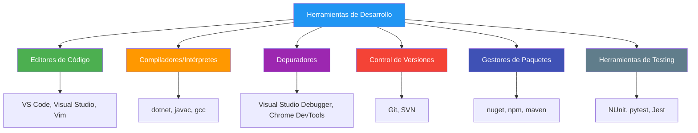
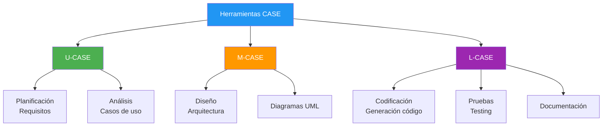
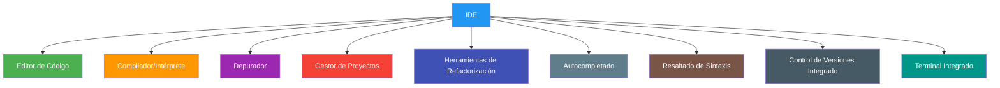

- [7. Herramientas de Apoyo al Desarrollo de Software](#7-herramientas-de-apoyo-al-desarrollo-de-software)
  - [7.1. Herramientas de Desarrollo](#71-herramientas-de-desarrollo)
  - [7.2. Herramientas CASE (Computer Aided Software Engineering)](#72-herramientas-case-computer-aided-software-engineering)
    - [7.2.1. Funcionalidad](#721-funcionalidad)
    - [7.2.2. Clasificación según fases](#722-clasificación-según-fases)
  - [7.3. Desarrollo Rápido de Aplicaciones (RAD)](#73-desarrollo-rápido-de-aplicaciones-rad)
  - [7.4. Entornos de Desarrollo Integrado (IDE)](#74-entornos-de-desarrollo-integrado-ide)

# 7. Herramientas de Apoyo al Desarrollo de Software

> 💡 **Punto de partida:** ¿Alguna vez te has preguntado cómo un programador puede crear una aplicación completa sin escribir todo el código desde cero? ¿O cómo se gestiona el trabajo en equipo cuando 10 personas modifican el mismo proyecto? La respuesta está en las herramientas de apoyo.

En el Punto 06 vimos los procesos de traducción y las máquinas virtuales. Ahora veremos las **herramientas** que facilitan y agilizan nuestro trabajo como desarrolladores.

**Objetivos de aprendizaje:**

- Conocer las herramientas principales del desarrollo de software
- Entender qué son las herramientas CASE y para qué sirven
- Diferenciar entre editores simples e IDEs
- Saber elegir la herramienta adecuada según el contexto

## 7.1. Herramientas de Desarrollo

En la práctica, para llevar a cabo varias de las etapas del desarrollo de software, se utilizan **herramientas informáticas**. Su finalidad principal es automatizar las tareas y ganar fiabilidad y tiempo. Esto permite a los desarrolladores centrarse en los requerimientos del sistema y el análisis, que son las causas principales de los fallos del software. Los tipos de software de desarrollo incluyen editores, compiladores e intérpretes.

> 💡 **Analogía:** Las herramientas de desarrollo son como los instrumentos de un mecánico. Puedes cambiar una rueda con una llave inglesa básica, pero con las herramientas adecuadas el trabajo es más rápido, seguro y profesional.

**Categorías de herramientas:**

| Categoría | Herramientas populares | Función |
|-----------|----------------------|---------|
| **Editores** | Visual Studio Code, Visual Studio, Vim | Escribir código |
| **Compiladores** | dotnet (C#), javac (Java), gcc (C/C++) | Traducir código |
| **Intérpretes** | dotnet run, node, python | Ejecutar directamente |
| **Depuradores** | Visual Studio Debugger, Chrome DevTools | Encontrar errores |
| **Control de versiones** | Git, SVN, Mercurial | Gestionar cambios |
| **Gestores de paquetes** | NuGet, npm, maven, gradle | Instalar librerías |
| **Testing** | NUnit, pytest, Jest | Verificar código |

> 📝 **Nota:** En DAM trabajaréis intensamente con estas herramientas. Dominar Visual Studio Code y Git es casi tan importante como saber programar. Son vuestras armas principales.

## 7.2. Herramientas CASE (Computer Aided Software Engineering)

Las **herramientas CASE** son un conjunto de aplicaciones que se utilizan en el desarrollo de software con el objetivo de reducir costes y tiempo del proceso, mejorando la productividad.

> 💡 **Nota:** CASE significa "Ingeniería de Software Asistida por Computadora", como CAD (Diseño Asistido por Computadora) pero para software.

### 7.2.1. Funcionalidad

- **Automatización de tareas repetitivas** en análisis, diseño y codificación
- **Generación automática de código** a partir de modelos
- **Creación de diagramas** (UML, ER, flujo)
- **Validación de requisitos** y consistencia
- **Documentación automática** del proyecto
- **Gestión de la configuración** del software

### 7.2.2. Clasificación según fases

Las herramientas CASE se clasifican según las fases del ciclo de vida en las que trabajan:

| Tipo | Fases | Ejemplos |
|------|-------|----------|
| **U-CASE** (Upper) | Planificación, Análisis | StarUML, Enterprise Architect |
| **M-CASE** (Middle) | Análisis, Diseño | Rational Rose, Visual Paradigm |
| **L-CASE** (Lower) | Codificación, Pruebas | Visual Studio, IDEs con generación de código |

**Herramientas CASE gratuitas/libres:**
- **ArgoUML:** http://argouml.tigris.org/ - Herramienta UML open source
- **Dia:** http://dia-installer.de/ - Diagramas diversos
- **StarUML:** https://staruml.io/ - UML con versión gratuita
- **PlantUML:** https://plantuml.com/ - UML mediante texto

> 📝 **Nota:** En ciclos de desarrollo, las herramientas CASE se usan especialmente en las fases de análisis y diseño para crear diagramas UML que documenten el sistema antes de programar.

## 7.3. Desarrollo Rápido de Aplicaciones (RAD)

El **Desarrollo Rápido de Aplicaciones (RAD)** es un proceso que comprende el desarrollo iterativo, la construcción de prototipos y el uso de utilidades CASE. Actualmente se utiliza para referirse al desarrollo rápido de interfaces gráficas de usuario o entornos de desarrollo integrado completos.

> 💡 **Nota:** RAD fue desarrollado por James Martin en 1991 como respuesta a la lentitud de los métodos tradicionales.

**Fases del RAD:**

**Ventajas del RAD:**
- Desarrollo más rápido (time-to-market reducido)
- Feedback temprano del usuario
- Mayor participación del cliente
- Prototipado rápido

**Desventajas:**
- Puede sacrificar calidad por velocidad
- Requiere usuarios disponibles para feedback
- No apto para proyectos muy grandes

**Herramientas RAD:**
- **Microsoft Power Apps:** Desarrollo low-code
- **OutSystems:** Plataforma RAD empresarial
- **Bubble:** Desarrollo web sin código
- **Retool:** Interfaces de gestión rápidas

> 📝 **Nota:** El movimiento "low-code" y "no-code" son herederos modernos de RAD. Permiten crear aplicaciones sin apenas programar, aunque tienen limitaciones.

## 7.4. Entornos de Desarrollo Integrado (IDE)

Un **Entorno de Desarrollo Integrado (IDE)** es una herramienta que facilita y posibilita el desarrollo de software. Agrupa diversas herramientas de desarrollo (editor de código, compilador, depurador) en una única interfaz gráfica para aumentar la productividad del programador.

**Componentes de un IDE:**

| Componente | Descripción | Ejemplo |
|------------|-------------|---------|
| **Editor avanzado** | Resaltado, sangrado, navegación | IntelliSense, snippets |
| **Compilador integrado** | Traducir sin salir del IDE | Build, Compile |
| **Depurador visual** | Puntos de ruptura, inspección | Breakpoints, watch |
| **Autocompletado** | Sugerencias de código | IntelliSense |
| **Refactorización** | Renombrar, extraer métodos | Rename, Extract |
| **Gestor de proyectos** | Organizar archivos | Solution Explorer |
| **Control de versiones** | Git integrado | Git panel |

**IDEs populares por lenguaje:**

| Lenguaje | IDE principal | Alternativas |
|----------|--------------|--------------|
| **C#** | JetBrains Rider | Visual Studio Code, Visual Studio |
| **Java** | IntelliJ IDEA | Eclipse, NetBeans |
| **Python** | PyCharm | VS Code, Spyder |
| **C/C++** | CLion | Visual Studio, VS Code |
| **JavaScript** | WebStorm | VS Code, Atom |
| **General** | Visual Studio Code | Sublime, Vim |

> 💡 **Consejo:** Para DAM, os recomiendo dominar Visual Studio Code porque es:
> - Ligero y rápido
> - Multiplataforma (Windows, Mac, Linux)
> - Extensible con miles de extensiones
> - Gratis y open source
> - Usado en la industria

**Extensiones esenciales para VS Code (DAM):**

| Extensión | Utilidad |
|-----------|----------|
| C# Dev Kit | Soporte completo para C#/.NET |
| Prettier | Formateo de código |
| ESLint | Linting JavaScript |
| Python (Microsoft) | Soporte Python |
| Java (Red Hat) | Soporte Java |
| Live Server | Servidor local para web |
| GitLens | Mejora Git |
| Material Icon Theme | Iconos atractivos |

> 💡 **Dato:** El primer IDE fue "Eclipse" (1999), desarrollado por IBM para Java. Antes, los programadores editaban archivos de texto en terminals y compilaban manualmente.

**Comparativa: Editor vs IDE**

| Característica | Editor simple | IDE |
|----------------|---------------|-----|
| Peso | Ligero | Pesado |
| Velocidad | Rápido | Más lento |
| Configuración | Manual | Viene todo integrado |
| Depuración | Externa | Integrada |
| Autocompletado | Básico | Avanzado |
| Ejemplos | VS Code, Vim | Rider, IntelliJ |
| Mejor para | Scripts, pequeños proyectos | Proyectos grandes |

---

**Resumen del punto:**

| Concepto | Descripción |
|----------|-------------|
| **Herramientas de desarrollo** | Editores, compiladores, depuradores, Git |
| **CASE** | Automatización del proceso de desarrollo |
| **RAD** | Desarrollo rápido con prototipos |
| **IDE** | Todo integrado en una sola aplicación |
| **VS Code** | Editor principal para DAM (ligero, gratuito) |
| **Visual Studio** | IDE completo para C# (el más potente) |

En el siguiente punto veremos los **perfiles profesionales** del desarrollo de software: quién hace qué en un equipo de desarrollo.
