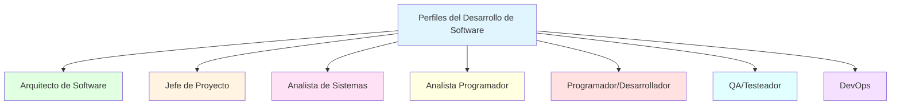

- [8. Perfiles del Desarrollo de Software](#8-perfiles-del-desarrollo-de-software)
  - [Arquitecto de Software](#arquitecto-de-software)
  - [Jefe de Proyecto](#jefe-de-proyecto)
  - [Analista de Sistemas](#analista-de-sistemas)
  - [Analista Programador](#analista-programador)
  - [Programador (o Desarrollador)](#programador-o-desarrollador)
  - [QA (Quality Assurance) / Testeador](#qa-quality-assurance--testeador)


# 8. Perfiles del Desarrollo de Software

---

El desarrollo de software es un proceso que involucra a diferentes profesionales, cada uno con roles y responsabilidades específicas a lo largo del ciclo de vida del software. Estos roles son cruciales para el éxito de un proyecto, combinando conocimientos técnicos, de gestión y de negocio.

> **💡 Analogía:** Un equipo de desarrollo de software es como una orquesta. Hay diferentes instrumentos (roles) que deben tocar juntos bajo la dirección de un director (jefe de proyecto) para crear una sinfonía coherente.



---

## Arquitecto de Software

- Este profesional tiene la responsabilidad de decidir "cómo" se realiza el proyecto y cómo se estructurará.
- Posee un amplio conocimiento de las tecnologías, los *frameworks* y las librerías disponibles.
- Decide y conforma los recursos necesarios para el desarrollo de un proyecto.
- Se involucra activamente en la fase de diseño.

**Responsabilidades principales:**
- Diseñar la arquitectura general del sistema
- Elegir tecnologías, frameworks y patrones
- Definir estándares y convenciones técnicas
- Tomar decisiones de alto impacto técnico
- Revisar código y diseños de otros desarrolladores

**Skills necesarios:**
- Amplia experiencia (5-10+ años)
- Conocimiento profundo de múltiples tecnologías
- Capacidad de diseño y abstracción
- Comunicación con stakeholders técnicos y no técnicos

> **📝 Salida profesional:** En DAM seréis programadores, pero con experiencia podréis crecer hacia roles de arquitectura. El arquitecto es el "veterano" del equipo técnico.

## Jefe de Proyecto

- Es el encargado de dirigir el curso del proyecto.
- Puede ser un analista con experiencia, un arquitecto o una persona dedicada en exclusividad a este puesto.
- Debe poseer habilidades para gestionar un equipo y lidar con los tiempos y plazos.
- Mantiene una comunicación continua y fluida con el cliente.

**Responsabilidades principales:**
- Planificar el proyecto (tiempo, recursos, presupuesto)
- Coordinar al equipo de desarrollo
- Gestionar expectativas del cliente
- Identificar y mitigar riesgos
- Reporting a dirección y stakeholders

**Skills necesarios:**
- Gestión de proyectos (PM, Agile, Scrum)
- Comunicación interpersonal
- Resolución de conflictos
- Gestión del tiempo
- Conocimientos técnicos (para entender al equipo)

> **💡 Dato:** Muchos jefes de proyecto en software provienen de perfiles técnicos (ex-programadores) porque entienden mejor las complejidades del desarrollo.

## Analista de Sistemas

- Realiza un estudio exhaustivo del problema a resolver.
- Efectúa el análisis y el diseño de todo el sistema.
- Este perfil requiere mucha experiencia y suele involucrarse en reuniones con el cliente para recopilar requisitos.
- Es la figura clave en la fase de **Análisis**, donde se determinan y definen las necesidades del cliente y los requisitos del software. También interviene en la fase de diseño.

**Responsabilidades principales:**
- Reuniones con el cliente para entender necesidades
- Documentar requisitos funcionales y no funcionales
- Crear casos de uso y historias de usuario
- Diseñar la estructura del sistema
- Crear documentación técnica

**Skills necesarios:**
- Pensamiento analítico
- Comunicación con clientes no técnicos
- Conocimiento de metodologías (UML, BPMN)
- Experiencia en el dominio del negocio

> **📝 Nota del Profesor:** El analista es el "traductor" entre lo que quiere el cliente (lenguaje de negocio) y lo que necesita el programador (lenguaje técnico). Es crucial para evitar malentendidos.

## Analista Programador

- Según las fuentes, este rol comparte muchas responsabilidades con el **Analista de Sistemas**, incluyendo la realización de un estudio exhaustivo del problema, la ejecución del análisis y diseño del sistema, y la interacción con el cliente.
- Este perfil también requiere mucha experiencia y conocimiento tanto en la definición de soluciones como en la capacidad de comprender la implementación técnica.

**Responsabilidades principales:**
- Combinar análisis técnico con programación
- Diseñar módulos y componentes específicos
- Implementar funcionalidades complejas
- Revisar código de otros programadores
- Mentorizar a programadores junior

**Skills necesarios:**
- Fuertes habilidades técnicas (programación)
- Capacidad de análisis y diseño
- Comunicación con analistas y programadores
- Conocimiento del negocio

> **💡 Diferencia:** El analista se centra en el "qué" (requisitos), el programador en el "cómo" (implementación). El analista-programador hace ambas cosas.

## Programador (o Desarrollador)

- Conoce en profundidad el lenguaje de programación que se utiliza en el proyecto.
- Se encarga de codificar las tareas encomendadas por el analista o el analista programador.
- Su misión principal es la de codificar y probar los diferentes módulos de la aplicación.
- Actúa en la fase de **Codificación (Implementación)**, escribiendo el código fuente y traduciendo los algoritmos a un lenguaje de programación.
- No suele intervenir en la fase de diseño.

**Niveles en la carrera del programador:**

| Nivel | Años experiencia | Responsabilidad |
|-------|------------------|-----------------|
| **Junior** | 0-2 | Tareas simples, supervisión necesaria |
| **Mid-level** | 2-5 | Tareas independientes, mentoring juniors |
| **Senior** | 5-10+ | Diseño técnico, decisiones complejas |
| **Lead/Tech Lead** | 8+ | Liderazgo técnico del equipo |

**Skills necesarios:**
- Dominio de al menos un lenguaje de programación
- Conocimiento de frameworks y librerías
- Resolución de problemas
- Lectura y escritura de código limpio
- Control de versiones (Git)
- Testing básico

> **📝 Salida profesional:** En DAM vuestra primera posición será Programador Junior. Con práctica y experiencia podréis ascender a niveles superiores.

## QA (Quality Assurance) / Testeador

- Aunque las fuentes no lo mencionan explícitamente como un "rol" con título específico en la lista de perfiles, la fase de **Pruebas** es fundamental y su objetivo principal es "conseguir que el programa funcione incorrectamente para descubrir y corregir defectos".
- Este rol se enfoca en someter el programa al máximo número de situaciones diferentes, realizando pruebas unitarias, de integración, funcionales, estructurales y *Beta Test*.
- La existencia de estas pruebas detalladas implica que hay personal dedicado o especializado en la validación y verificación del software construido, asegurando su calidad antes de la entrega al cliente.
- Los programadores también tienen la misión de probar los módulos que desarrollan, pero en proyectos más grandes o complejos, se suelen establecer roles dedicados a la calidad y las pruebas.

**Responsabilidades principales:**
- Diseñar casos de prueba
- Ejecutar pruebas manuales y automatizadas
- Reportar bugs y verificar correcciones
- Automatizar pruebas de regresión
- Definir métricas de calidad

**Skills necesarios:**
- Pensamiento creativo (encontrar casos límite)
- Conocimiento de herramientas de testing
- Automatización (Selenium, Cypress, etc.)
- Comunicación con desarrolladores
- Conocimiento técnico del sistema

> **💡 Dato:** El testing es una carrera en sí misma. Hay QA manual, automatización de pruebas, testing de rendimiento, security testing, etc.

## DevOps (Perfil moderno adicional)

Aunque no aparece en el contenido original, DevOps es un perfil esencial en equipos modernos:

**Responsabilidades principales:**
- Automatizar despliegues (CI/CD)
- Gestionar infraestructura (Cloud, Docker, Kubernetes)
- Monitorización y logging
- Optimizar rendimiento
- Seguridad (DevSecOps)

**Skills necesarios:**
- Scripting (Bash, Python)
- Contenedores (Docker, Kubernetes)
- Cloud (AWS, Azure, GCP)
- Pipelines CI/CD (Jenkins, GitHub Actions)
- Infrastructure as Code

## Organigrama típico de un equipo de desarrollo

```
                    ┌─────────────────┐
                    │   Product Owner │
                    └────────┬────────┘
                             │
                    ┌────────▼────────┐
                    │  Scrum Master   │
                    │  (Jefe Proyecto)│
                    └────────┬────────┘
                             │
        ┌────────────────────┼────────────────────┐
        │                    │                    │
┌───────▼───────┐    ┌───────▼───────┐    ┌───────▼───────┐
│   Arquitecto  │    │   Desarrolladores    │      QA       │
│  (Tech Lead)  │    │   (Junior/Senior)    │   (Tester)    │
└───────────────┘    └────────────────────┘    └─────────────┘
```

> **📝 Nota del Profesor:** En empresas pequeñas o startups, una persona puede acumular varios roles (programador + QA + DevOps). En empresas grandes, cada rol está especializado. En DAM vais a aprender los fundamentos de todos estos roles.
