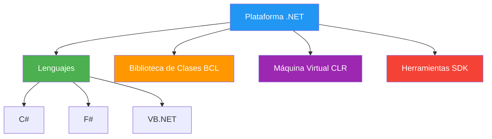
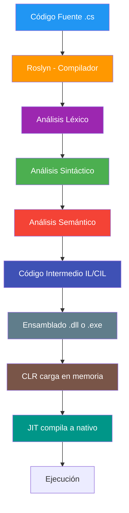
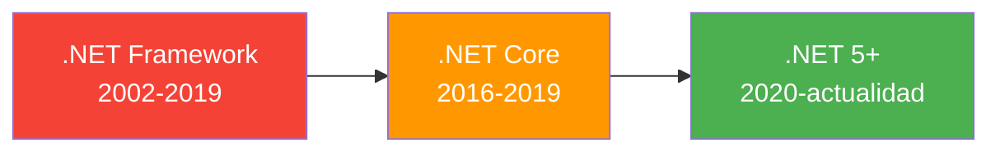

- [9. Caso de Estudio: El Lenguaje C# y la Plataforma .NET](#9-caso-de-estudio-el-lenguaje-c-y-la-plataforma-net)
  - [9.1. Introducción a C# y .NET](#91-introducción-a-c-y-net)
  - [9.2. Clasificación de C# según lo visto en la unidad](#92-clasificación-de-c-según-lo-visto-en-la-unidad)
    - [9.2.1. Según nivel de abstracción](#921-según-nivel-de-abstracción)
    - [9.2.2. Según mecanismo de traducción](#922-según-mecanismo-de-traducción)
    - [9.2.3. Según sistema de tipos](#923-según-sistema-de-tipos)
    - [9.2.4. Según paradigma](#924-según-paradigma)
    - [9.2.5. Según generación](#925-según-generación)
  - [9.3. El proceso de compilación en C# (Roslyn)](#93-el-proceso-de-compilación-en-c-roslyn)
    - [9.3.1. ¿Qué es Roslyn?](#931-qué-es-roslyn)
    - [9.3.2. Fases de compilación en C#](#932-fases-de-compilación-en-c)
    - [9.3.3. Enlazador y generación de ensamblados](#933-enlazador-y-generación-de-ensamblados)
  - [9.4. La máquina virtual: CLR y JIT](#94-la-máquina-virtual-clr-y-jit)
    - [9.4.1. ¿Qué es la CLR (Common Language Runtime)?](#941-qué-es-la-clr-common-language-runtime)
    - [9.4.2. JIT (Just-In-Time Compilation)](#942-jit-just-in-time-compilation)
    - [9.4.3. Comparación con Java](#943-comparación-con-java)
  - [9.5. .NET Framework vs .NET (Core)](#95-net-framework-vs-net-core)
  - [9.6. Resumen](#96-resumen)


# 9. Caso de Estudio: El Lenguaje C# y la Plataforma .NET

> 💡 **Punto de partida:** Hemos visto teoría sobre lenguajes, compilación, máquinas virtuales... pero, ¿cómo funciona todo esto en la práctica? Vamos a aplicar todo lo aprendido a un lenguaje real: C#.

> 💡 **¿Por qué me importa?**
> Porque C# y .NET son la tecnología que usaréis en este ciclo. Aquí convergen TODOS los conceptos anteriores: C# es un lenguaje (Punto 05) que se compila (Punto 06) usando herramientas (Punto 07) en un equipo con roles (Punto 08) siguiendo un modelo de desarrollo (Punto 04).
> 
> 🔗 **Conexión con todos los puntos anteriores:** C# es el hilo conductor de toda la unidad: lenguaje de alto nivel (Punto 05), compilado a código intermedio (Punto 06), ejecutado por CLR/JIT (Punto 02), desarrollado con IDEs como Rider (Punto 07), en equipos que usan Scrum (Punto 04), siguiendo el ciclo de vida (Punto 03).

En los puntos anteriores vimos los conceptos teóricos. Ahora veremos cómo se aplican a un lenguaje real que usarás en DAW.

**Objetivos de aprendizaje:**

- Conocer qué es C# y .NET
- Clasificar C# según todas las dimensiones vistas
- Entender el proceso de compilación con Roslyn
- Comprender el papel de la CLR y el JIT

## 9.1. Introducción a C# y .NET

**C#** (pronunciado "C-sharp") es un lenguaje de programación orientado a objetos desarrollado por Microsoft bajo la dirección de **Anders Hejlsberg** (creador también de Turbo Pascal y Delphi). Fue lanzado en el año **2000** como parte de la plataforma .NET.

> 💡 **Analogía:** Si Java es el "detrás de la puerta" de la programación empresarial, C# es el "detrás de Windows". Microsoft creó C# para tener su propio lenguaje moderno que compitiera con Java y dominara el ecosistema Windows.

**¿Qué es .NET?**

.NET es la **plataforma** (no solo un lenguaje) que incluye:
- El lenguaje C# (y otros como F#, VB.NET)
- La biblioteca de clases (BCL)
- La máquina virtual (CLR)
- Herramientas de desarrollo (SDK, CLI)



**Versiones importantes:**

| Año | Versión | Novedad |
|-----|---------|---------|
| 2000 | C# 1.0 | Primer versión |
| 2005 | C# 2.0 | Generics |
| 2008 | C# 3.0 | LINQ, Lambda |
| 2012 | C# 5.0 | async/await |
| 2014 | C# 6.0 | String interpolation, expression-bodied |
| 2019 | C# 8.0 | Nullable reference types |
| 2021 | C# 10 | Global using, file-scoped namespaces |
| 2022 | C# 11 | Raw string literals |
| 2023 | C# 12 | Primary constructors, collection expressions |
| 2024 | C# 13 | params collections, lock statement |
| 2025 | C# 14 | Extension functions, field keyword |

## 9.2. Clasificación de C# según lo visto en la unidad

### 9.2.1. Según nivel de abstracción

C# es un lenguaje de **alto nivel**. Esto significa que está muy cerca del lenguaje humano y muy lejos del lenguaje máquina.

**Comparativa:**

```csharp
// Alto nivel (C#)
int suma = 5 + 3;
```

```asm
; Bajo nivel (Ensamblador x86)
MOV AX, 5
ADD AX, 3
```

```
; Lenguaje máquina (binario)
10110000 00000101
00000011 00000011
```

> 📝 **Nota:** En C# no necesitas saber cómo funciona el procesador por dentro. El compilador y la CLR se encargan de traducir tu código a algo que la máquina entienda.

### 9.2.2. Según mecanismo de traducción

C# es un lenguaje **mixto** (compilado + interpretado). No se ejecuta directamente como C, ni se interpreta línea a línea como Python. Sigue un proceso intermedio:

```
Código fuente (.cs)
        ↓ Roslyn (compilador)
Código intermedio (IL/CIL)
        ↓ JIT (Just-In-Time)
Código máquina nativo
```

**Ejemplo real:**

```csharp
// Este código...
Console.WriteLine("Hola Mundo");
```

```il
// ...se compila a este Código Intermedio (IL)
IL_0000: ldstr "Hola Mundo"
IL_0005: call void [System.Console]::WriteLine(string)
IL_000A: ret
```

```asm
; ...y el JIT lo convierte a esto (x86)
mov ecx, [Hola Mundo]
call 0x7FFA12345678  ; dirección de Console.WriteLine
ret
```

> 💡 **Dato:** El código intermedio (IL) es independiente de la máquina. Por eso un archivo .dll de C# puede ejecutarse en Windows, Linux o Mac (si tiene la CLR correspondiente).

### 9.2.3. Según sistema de tipos

C# es **estático y fuerte**.

- **Estático**: Los tipos se verifican en compilación (antes de ejecutar)
- **Fuerte**: No permite conversiones implícitas entre tipos incompatibles

```csharp
// ✅ BUENO: tipado estático y fuerte
int numero = 42;
string texto = "hola";
// numero = texto;  // ❌ Error de compilación: Cannot implicitly convert type 'string' to 'int'

// ✅ Inferencia de tipos (var)
var edad = 25;        // infiere int
var nombre = "Ana";   // infiere string
// edad = "texto";   // ❌ Error: ya sabemos que es int
```

**Comparativa con otros lenguajes:**

| Lenguaje | Tipado | Ejemplo |
|----------|--------|---------|
| **C#** | Estático, fuerte | `int x = 5;` (error si pones string) |
| **Java** | Estático, fuerte | `int x = 5;` |
| **Python** | Dinámico, fuerte | `x = 5` (puede cambiar a string) |
| **JavaScript** | Dinámico, débil | `x = 5; x = "hola";` (funciona) |

### 9.2.4. Según paradigma

C# es **multiparadigma**. Soporta varios estilos de programación:

**Imperativo:**
```csharp
int suma = 0;
for (int i = 1; i <= 10; i++)
{
    suma += i;
}
Console.WriteLine($"Suma: {suma}");
```

**Orientado a Objetos (POO):**
```csharp
class Animal
{
    public string Nombre { get; set; }
    public virtual void Hablar() => Console.WriteLine("...");
}

class Perro : Animal
{
    public override void Hablar() => Console.WriteLine("Guau!");
}
```

**Funcional (con LINQ y lambdas):**
```csharp
int[] numeros = [1, 2, 3, 4, 5, 6, 7, 8, 9, 10];

var pares = numeros.Where(x => x % 2 == 0)
                   .Select(x => x * x);

// Resultado: 4, 16, 36, 64, 100
```

**Eventos:**
```csharp
miBoton.Click += (sender, e) =>
{
    MessageBox.Show("¡Pulsado!");
};
```

### 9.2.5. Según generación

C# es de **tercera generación (3GL)**. Utiliza sentencias similares al inglés, es independiente de la máquina y permite el uso de estructuras de alto nivel como clases, bucles y funciones.

## 9.3. El proceso de compilación en C# (Roslyn)

### 9.3.1. ¿Qué es Roslyn?

**Roslyn** es el compilador de C# y VB.NET. Lo curioso es que está escrito en... ¡C#! Es un compilador que se compila a sí mismo (bootstrapping).

Roslyn realiza las tres fases del análisis que vimos en el Punto 06:

| Fase | Qué hace | Ejemplo de error |
|------|----------|------------------|
| **Léxico** | Divide en tokens | `int x = ;` → "unexpected token" |
| **Sintáctico** | Verifica estructura | `if (x > {` → "syntax error" |
| **Semántico** | Verifica sentido | `int x = "hola";` → "cannot convert string to int" |

---

### 9.3.2. Fases de compilación en C#

Primero, conozcamos los términos que usaremos:

| Término | Significado | Analogía |
|---------|-------------|----------|
| **Roslyn** | El compilador de C# (escrito en C#) | El traductor que convierte tu español a otro idioma |
| **IL / CIL** | Código Intermedio / Common Intermediate Language. Instrucciones abstractas que no dependen de ninguna máquina concreta | Un "español neutro" que todos entienden |
| **Ensamblado** | Archivo `.dll` o `.exe` que contiene IL + metadata + referencias | Un "paquete" listo para enviar |
| **CLR** | Common Language Runtime. La máquina virtual de .NET que ejecuta el código | El "intérprete" que entiende IL y lo ejecuta |
| **JIT** | Just-In-Time Compiler. Convierte IL a código máquina nativo en tiempo de ejecución | El "traductor final" que habla directamente con el procesador |
| **Metadata** | Información sobre tipos, métodos, propiedades del código | El "índice" del libro |
| **GC** | Garbage Collector. Gestiona la memoria automáticamente | El "limpiador" que libera memoria que ya no se usa |



**Cada fase de Roslyn:**

| Fase | Qué hace | Qué se logra | Ejemplo de error |
|------|----------|--------------|------------------|
| **Análisis Léxico** | Divide el código en tokens (palabras, símbolos) | Unificar espacios, comentarios y detectar caracteres inválidos | `int x = ;` → "token inesperado" |
| **Análisis Sintáctico** | Verifica que los tokens sigan las reglas gramaticales | Un árbol de sintaxis abstracto (AST) correcto | `if (x > {` → "error de sintaxis" |
| **Análisis Semántico** | Comprueba que el código tenga sentido lógico | Detectar tipos incompatibles, variables no declaradas | `int x = "hola";` → "no se puede convertir string a int" |
| **Código IL/CIL** | Genera instrucciones intermedias independientes de la máquina | Un archivo que puede ejecutarse en cualquier plataforma con CLR | — |
| **Ensamblado** | Empaqueta IL + metadata + referencias en un `.dll` o `.exe` | Un módulo listo para ser cargado por la CLR | — |
| **CLR carga** | Lee el ensamblado y verifica seguridad | El código está en memoria y listo para ejecutarse | "TypeLoadException" si falta una librería |
| **JIT compila** | Convierte IL a código máquina nativo para el hardware concreto | Código optimizado para tu procesador específico | — |

> 💡 **Ejemplo real:** Cuando escribes `Console.WriteLine("Hola")`, Roslyn analiza léxico (detecta `Console`, `.`, `WriteLine`, `(`, `"Hola"`, `)`), luego verifica sintaxis (¿está bien formado?), luego semántica (¿existe `WriteLine` en `Console`? ¿acepta un string?), y finalmente genera IL que la CLR ejecutará.

**Ejemplo práctico:**

```csharp
// Archivo: HolaMundo.cs
Console.WriteLine("¡Hola desde C#!");
```

Desde C# 9 (2020), puedes escribir código directamente en un archivo .cs sin necesidad de `class Program` ni método `Main`. Esto se llama **Top Level Statements** y hace que el código sea más limpio y fácil de leer para principiantes. El compilador genera la clase Main por debajo.

```bash
# Compilar con dotnet CLI
dotnet build

# Resultado: bin/Debug/net10.0/HolaMundo.dll
```

**Ejemplo completo: de C# a ejecución**
1. Creas el proyecto: `dotnet new console -n MiApp`
2. Escribes código en `Program.cs`
3. Compilas: `dotnet build` → Roslyn genera `MiApp.dll` (código IL) en `bin/Debug/net10.0/`
4. Ejecutas: `dotnet run` → CLR carga el `.dll`, JIT compila a máquina, CPU ejecuta
5. Puedes ver el IL con herramientas como `ildasm` o con el desensamblador de Rider

El `.dll` contiene:
- **Código IL**: Las instrucciones intermedias
- **Metadata**: Tipos, métodos, referencias
- **Ensamblados referenciados**: Qué librerías usa

### 9.3.3. Enlazador y generación de ensamblados

Cuando compilas, Roslyn genera un **ensamblado** (`.dll` o `.exe`). Este ensamblado contiene:

```
┌─────────────────────────────┐
│       Ensamblado .dll       │
├─────────────────────────────┤
│ Header del ensamblado       │
│ Metadata (tipos, métodos)   │
│ Código IL                   │
│ Referencias a otros .dll    │
│ Recursos (imágenes, etc.)   │
└─────────────────────────────┘
```

> 📝 **Nota:** A diferencia de C/C++ donde necesitas un enlazador externo, en C# el enlazador está integrado en la CLR. Ella resuelve las referencias entre ensamblados en tiempo de ejecución.

## 9.4. La máquina virtual: CLR y JIT

### 9.4.1. ¿Qué es la CLR (Common Language Runtime)?

La **CLR** es la máquina virtual de .NET. Es el equivalente a la JVM de Java. Cuando ejecutas un programa C#, la CLR:

1. **Carga** el ensamblado en memoria
2. **Verifica** el código (¿es seguro?)
3. **Gestiona la memoria** (Garbage Collector)
4. **Compila a nativo** (JIT)

```csharp
// La CLR gestiona la memoria automáticamente
string nombre = "Ana";  // Reserva memoria
// ... usamos nombre ...
// Cuando ya no se usa, el Garbage Collector libera la memoria
```

**¿Cuándo se ejecuta el GC?**
- Se ejecuta periódicamente cuando el sistema detecta que hay suficiente basura acumulada.
- También cuando falta memoria.
- Puedes forzarlo con `GC.Collect()`, pero **no se recomienda** en producción porque causa una pausa en la ejecución.
- El GC es uno de los grandes beneficios de C# sobre C++: no tienes que gestionar la memoria manualmente.

> 💡 **Analogía:** La CLR es como un traductor automático que llevas en el bolsillo. Tú hablas en "C#" y ella traduce al "procesador" en tiempo real.

### 9.4.2. JIT (Just-In-Time Compilation)

El **JIT** (Compilación Justo a Tiempo) es el proceso que convierte el código IL a código máquina nativo.


**¿Por qué JIT y no compilación completa?**

| Ventaja | Explicación |
|---------|-------------|
| **Portabilidad** | El mismo .dll funciona en cualquier plataforma con CLR |
| **Optimización** | JIT optimiza para el hardware concreto del usuario |
| **Seguridad** | Se verifica el código antes de ejecutar |

**¿Qué pasa la segunda vez?**

El JIT guarda el código nativo en caché. La segunda vez que ejecutas el mismo método, ya tiene el código máquina listo sin necesidad de recompilar.

### 9.4.3. Comparación con Java

| Característica | C# (.NET/CLR) | Java (JVM) |
|----------------|---------------|------------|
| **Compilador** | Roslyn | javac |
| **Código intermedio** | IL/CIL | Bytecode |
| **Máquina virtual** | CLR | JVM |
| **Compilación JIT** | Siempre | Siempre |
| **Gestión memoria** | Garbage Collector | Garbage Collector |
| **Portabilidad** | Multiplataforma | Multiplataforma |
| **Rendimiento** | Muy alto | Alto |

> 💡 **Dato:** Históricamente C# era solo Windows. Desde .NET Core (2016), C# puede ejecutarse en Linux, Mac, iOS, Android, etc. Hoy en día es tan multiplataforma como Java.

## 9.5. .NET Framework vs .NET (Core)

.NET ha tenido una evolución importante:



| Característica | .NET Framework | .NET (Core+) |
|----------------|----------------|--------------|
| **Plataforma** | Solo Windows | Multiplataforma |
| **Rendimiento** | Bueno | Excelente |
| **Futuro** | Mantenimiento | Desarrollo activo |
| **NuGet** | Parcial | Completo |
| **CLI** | NuGet Package Manager | dotnet CLI |

**¿Qué es NuGet?** Es el gestor de paquetes de .NET, similar a npm para JavaScript o pip para Python. Contiene miles de librerías gratuitas que otros desarrolladores han creado.

**Ejemplo: instalar una librería**
```bash
dotnet add package Newtonsoft.Json
```

Esto descarga la librería JSON.NET y la añade a tu proyecto. Puedes usarla con `using Newtonsoft.Json;`. NuGet resuelve automáticamente las dependencias (si una librería necesita otra, la instala también).

> 📝 **Nota:** En DAW usaremos **.NET 10** (la versión más reciente). Es multiplataforma, rápido y tiene todas las características modernas de C#.

## 9.6. Resumen

| Clasificación | C# |
|---------------|-----|
| **Nivel** | Alto |
| **Traducción** | Mixto (compilado a IL + JIT a nativo) |
| **Tipado** | Estático y fuerte |
| **Paradigma** | Multiparadigma (imperativo, POO, funcional, eventos) |
| **Generación** | 3GL |
| **Compilador** | Roslyn (escrito en C#) |
| **Máquina virtual** | CLR (Common Language Runtime) |
| **Código intermedio** | IL/CIL (Common Intermediate Language) |
| **Gestión memoria** | Garbage Collector automático |
| **Plataforma** | .NET 10 (multiplataforma) |

> 📝 **Nota:** C# es un ejemplo perfecto de todo lo que hemos visto en la unidad. Es alto nivel, mixto, estático, fuerte, multiparadigma y funciona con una máquina virtual que gestiona la memoria automáticamente.

En el siguiente punto haremos un **resumen** de toda la unidad, consolidando todos los conceptos vistos.
