- [9. Resumen y Conclusiones](#9-resumen-y-conclusiones)
  - [9.1. Mapa Conceptual de la Unidad](#91-mapa-conceptual-de-la-unidad)
  - [9.2. Conceptos Clave](#92-conceptos-clave)
    - [Software y Hardware](#software-y-hardware)
    - [Ciclo de Vida del Software](#ciclo-de-vida-del-software)
    - [Modelos de Desarrollo](#modelos-de-desarrollo)
    - [Lenguajes de Programación](#lenguajes-de-programación)
    - [Proceso de Traducción](#proceso-de-traducción)
    - [Máquinas Virtuales](#máquinas-virtuales)
  - [9.3. Herramientas y Perfiles](#93-herramientas-y-perfiles)
    - [Herramientas CASE (por fases)](#herramientas-case-por-fases)
    - [IDE](#ide)
    - [Perfiles](#perfiles)
  - [9.4. Checklist de Supervivencia](#94-checklist-de-supervivencia)

# 9. Resumen y Conclusiones

---

## 9.1. Mapa Conceptual de la Unidad

```mermaid
graph TD
    UD01[UD01: Desarrollo de Software] --> SWHW[Software y Hardware]
    UD01 --> CV[Ciclo de Vida]
    UD01 --> MM[Modelos y Metodologías]
    UD01 --> LP[Lenguajes de Programación]
    UD01 --> PT[Proceso de Traducción]
    UD01 --> HA[Herramientas de Apoyo]
    UD01 --> PE[Perfiles Profesionales]

    SWHW --> SWS[Sistema, Aplicación, Desarrollo]
    SWHW --> HWR[CPU, RAM, Disco, E/S]

    CV --> PLA[Planificación]
    CV --> ANA[Análisis]
    CV --> DIS[Diseño]
    CV --> COD[Codificación]
    CV --> PRU[Pruebas]
    CV --> DOC[Documentación]
    CV --> EXP[Explotación]
    CV --> MAN[Mantenimiento]

    MM --> CLA[Clásicos: Cascada, V]
    MM --> PRO[Prototipos]
    MM --> EVO[Evotulivos: Espiral]
    MM --> AGI[Ágiles: Scrum, Kanban, XP]

    LP --> NIV[Nivel: Bajo, Medio, Alto]
    LP --> TRA[Traducción: Compilado, Interpretado, Mixto]
    LP --> TIP[Tipado: Estático/Dinámico, Fuerte/Débil]
    LP --> PAR[Paradigmas: POO, Funcional, Imperativo]

    PT --> LEX[Análisis Léxico]
    PT --> SIN[Análisis Sintáctico]
    PT --> SEM[Análisis Semántico]
    PT --> INT[Generación Código Intermedio]
    PT --> OPT[Optimización]
    PT --> OBJ[Generación Código Objeto]
    PT --> ENL[Enlazador]

    HA --> IDE[IDE]
    HA --> CASE[U-CASE, M-CASE, L-CASE]
    HA --> RAD[RAD]

    PE --> ARQ[Arquitecto]
    PE --> JEF[Jefe de Proyecto]
    PE --> ANA[Analista]
    PE --> PRO[Programador]
    PE --> QA[QA / Tester]
```

## 9.2. Conceptos Clave

### Software y Hardware
- **Software:** Parte lógica (sistema, aplicación, desarrollo)
- **Hardware:** Parte física (CPU, RAM, disco, periféricos)
- **Relación:** El SO actúa como intermediario entre aplicaciones y hardware

### Ciclo de Vida del Software
1. **Planificación:** Objetivos, viabilidad y costes
2. **Análisis:** Requisitos funcionales y no funcionales (ERS)
3. **Diseño:** Arquitectura y especificación de módulos
4. **Codificación:** Escritura del código fuente
5. **Pruebas:** Unitarias, integración, funcionales, beta
6. **Documentación:** Técnica, usuario, instalación
7. **Explotación:** Despliegue y puesta en producción
8. **Mantenimiento:** Correctivo, perfectivo, evolutivo, adaptativo

### Modelos de Desarrollo
- **Clásicos:** Cascada (rígido, lineal), Modelo en V (verificación paralelas)
- **Prototipos:** Rápidos (desechables) o evolutivos
- **Evolutivos:** Iterativo Incremental, Espiral (gestión de riesgos)
- **Ágiles:** Manifiesto Ágil, Scrum (sprints), Kanban (flujo), XP (parejas)

### Lenguajes de Programación
- **Por nivel:** Bajo (máquina, ensamblador), Medio (C), Alto (Java, Python)
- **Por traducción:** Compilados (C++), Interpretados (JS), Mixtos (Java)
- **Por tipado:** Estático vs Dinámico, Fuerte vs Débil
- **Paradigmas:** Imperativa, POO, Funcional, Declarativa

### Proceso de Traducción
1. **Análisis Léxico:** Tokens
2. **Análisis Sintáctico:** Árbol sintáctico
3. **Análisis Semántico:** Compatibilidad de tipos
4. **Código Intermedio:** Representación independiente
5. **Optimización:** Mejora de eficiencia
6. **Código Objeto:** Binario no ejecutable
7. **Enlazador:** Une librerías y genera ejecutable

### Máquinas Virtuales
- **Concepto:** Capa entre bytecode y hardware (portabilidad)
- **Ejemplos:** JVM, .NET CLR
- **Runtime:** Entorno de ejecución (JRE)
- **Framework:** Estructura de apoyo (Spring, .NET)

## 9.3. Herramientas y Perfiles

### Herramientas CASE (por fases)
- **U-CASE:** Planificación y análisis
- **M-CASE:** Análisis y diseño
- **L-CASE:** Programación y pruebas

### IDE
- Editor de código + Compilador + Depurador + Herramientas adicionales

### Perfiles
- **Arquitecto:** Diseño técnico y decisiones tecnológicas
- **Jefe de Proyecto:** Gestión y comunicación con cliente
- **Analista:** Requisitos y diseño del sistema
- **Programador:** Codificación y pruebas unitarias
- **QA/Tester:** Validación y verificación de calidad

## 9.4. Checklist de Supervivencia

Antes de dar por cerrado el tema, asegúrate de poder responder **SÍ** a estas preguntas:

- [ ] ¿Diferencio entre software de sistema, aplicación y desarrollo?
- [ ] ¿Conozco las fases del ciclo de vida y sus objetivos?
- [ ] ¿Puedo comparar un modelo en cascada con una metodología ágil como Scrum?
- [ ] ¿Clasifico un lenguaje según nivel, traducción y tipado?
- [ ] ¿Describo las fases de un compilador?
- [ ] ¿Explico qué es una máquina virtual y para qué sirve?
- [ ] ¿Identifico las herramientas CASE según las fases del ciclo de vida?
- [ ] ¿Conozco los roles principales en un equipo de desarrollo?
