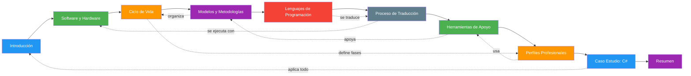

- [10. Resumen y Conclusiones](#10-resumen-y-conclusiones)
  - [10.1. Mapa Conceptual de la Unidad](#101-mapa-conceptual-de-la-unidad)
  - [10.2. Conceptos Clave](#102-conceptos-clave)
    - [Software y Hardware](#software-y-hardware)
    - [Ciclo de Vida del Software](#ciclo-de-vida-del-software)
    - [Modelos de Desarrollo](#modelos-de-desarrollo)
    - [Lenguajes de Programación](#lenguajes-de-programación)
    - [Proceso de Traducción](#proceso-de-traducción)
    - [Máquinas Virtuales](#máquinas-virtuales)
    - [C# y .NET](#c-y-net)
  - [10.3. Herramientas y Perfiles](#103-herramientas-y-perfiles)
    - [Herramientas CASE (por fases)](#herramientas-case-por-fases)
    - [IDE](#ide)
    - [Perfiles](#perfiles)
  - [10.4. Checklist de Supervivencia](#104-checklist-de-supervivencia)
  - [10.5. Errores Comunes a Evitar](#105-errores-comunes-a-evitar)
  - [10.6. Glosario de Términos](#106-glosario-de-términos)
  - [10.7. Ejercicios de Repaso](#107-ejercicios-de-repaso)
  - [10.8. ¿Qué viene después?](#108-qué-viene-después)
  - [10.9. Mapa de Conexiones entre Temas](#109-mapa-de-conexiones-entre-temas)

# 10. Resumen y Conclusiones

> 💡 **Punto de partida:** Hemos recorrido todo el camino desde qué es el software hasta los perfiles profesionales. Este resumen consolida todo lo aprendido.

Hemos visto la teoría completa del Desarrollo de Software. Este punto consolida todos los conceptos en una sola mirada.

**Objetivos de aprendizaje:**

- Repasar los conceptos fundamentales de la unidad
- Consolidar el vocabulario técnico
- Tener una referencia rápida para el examen

## 10.1. Mapa Conceptual de la Unidad

```mermaid
graph TD
    UD01[UD01: Desarrollo de Software] --> SWHW[Software y Hardware]
    UD01 --> CV[Ciclo de Vida]
    UD01 --> MM[Modelos y Metodologías]
    UD01 --> LP[Lenguajes de Programación]
    UD01 --> PT[Proceso de Traducción]
    UD01 --> HA[Herramientas de Apoyo]
    UD01 --> PE[Perfiles Profesionales]
    UD01 --> CS[Caso de Estudio: C#/.NET]

    SWHW --> SWS[Sistema, Aplicación, Desarrollo]
    SWHW --> HWR[CPU, RAM, Disco, E/S]

    CV --> PLA[Planificación]
    CV --> ANA[Análisis]
    CV --> DIS[Diseño]
    CV --> COD[Codificación]
    CV --> PRU[Pruebas]
    CV --> DOC[Documentación]
    CV --> EXP[Explotación]
    CV --> MAN[Mantenimiento]

    MM --> CLA[Clásicos: Cascada, V]
    MM --> PRO[Prototipos]
    MM --> EVO[Evolutivos: Espiral]
    MM --> AGI[Ágiles: Scrum, Kanban, XP]

    LP --> NIV[Nivel: Bajo, Medio, Alto]
    LP --> TRA[Traducción: Compilado, Interpretado, Mixto]
    LP --> TIP[Tipado: Estático/Dinámico, Fuerte/Débil]
    LP --> PAR[Paradigmas: POO, Funcional, Imperativo]

    PT --> LEX[Análisis Léxico]
    PT --> SIN[Análisis Sintáctico]
    PT --> SEM[Análisis Semántico]
    PT --> INT[Generación Código Intermedio]
    PT --> OPT[Optimización]
    PT --> OBJ[Generación Código Objeto]
    PT --> ENL[Enlazador]

    HA --> IDE[IDE]
    HA --> CASE[U-CASE, M-CASE, L-CASE]
    HA --> RAD[RAD]

    PE --> ARQ[Arquitecto]
    PE --> JEF[Jefe de Proyecto]
    PE --> ANA[Analista]
    PE --> PRO[Programador]
    PE --> QA[QA / Tester]

    CS --> CS1[C#: Alto nivel, mixto, estático]
    CS --> CS2[.NET: CLR, JIT, BCL]
    CS --> CS3[Roslyn: Compilador]

    style UD01 fill:#2196F3,color:#fff
    style SWHW fill:#4CAF50,color:#fff
    style CV fill:#FF9800,color:#fff
    style MM fill:#9C27B0,color:#fff
    style LP fill:#f44336,color:#fff
    style PT fill:#607D8B,color:#fff
    style HA fill:#4CAF50,color:#fff
    style PE fill:#FF9800,color:#fff
    style CS fill:#2196F3,color:#fff
```

## 10.2. Conceptos Clave

### Software y Hardware
- **Software:** Parte lógica (sistema, aplicación, desarrollo)
- **Hardware:** Parte física (CPU, RAM, disco, periféricos)
- **Relación:** El SO actúa como intermediario entre aplicaciones y hardware

### Ciclo de Vida del Software
1. **Planificación:** Objetivos, viabilidad y costes
2. **Análisis:** Requisitos funcionales y no funcionales (ERS)
3. **Diseño:** Arquitectura y especificación de módulos
4. **Codificación:** Escritura del código fuente
5. **Pruebas:** Unitarias, integración, funcionales, beta
6. **Documentación:** Técnica, usuario, instalación
7. **Explotación:** Despliegue y puesta en producción
8. **Mantenimiento:** Correctivo, perfectivo, evolutivo, adaptativo

### Modelos de Desarrollo
- **Clásicos:** Cascada (rígido, lineal), Modelo en V (verificación paralelas)
- **Prototipos:** Rápidos (desechables) o evolutivos
- **Evolutivos:** Iterativo Incremental, Espiral (gestión de riesgos)
- **Ágiles:** Manifiesto Ágil, Scrum (sprints), Kanban (flujo), XP (parejas)

### Lenguajes de Programación
- **Por nivel:** Bajo (máquina, ensamblador), Medio (C), Alto (Java, Python)
- **Por traducción:** Compilados (C++), Interpretados (JS), Mixtos (Java)
- **Por tipado:** Estático vs Dinámico, Fuerte vs Débil
- **Paradigmas:** Imperativa, POO, Funcional, Declarativa

### Proceso de Traducción
1. **Análisis Léxico:** Tokens
2. **Análisis Sintáctico:** Árbol sintáctico
3. **Análisis Semántico:** Compatibilidad de tipos
4. **Código Intermedio:** Representación independiente
5. **Optimización:** Mejora de eficiencia
6. **Código Objeto:** Binario no ejecutable
7. **Enlazador:** Une librerías y genera ejecutable

### Máquinas Virtuales
- **Concepto:** Capa entre bytecode y hardware (portabilidad)
- **Ejemplos:** JVM, .NET CLR
- **Runtime:** Entorno de ejecución (JRE)
- **Framework:** Estructura de apoyo (Spring, .NET)

### C# y .NET
- **C#:** Lenguaje de alto nivel, mixto, estático, fuerte, multiparadigma
- **.NET:** Plataforma que incluye CLR (máquina virtual) y BCL (biblioteca)
- **Roslyn:** Compilador de C# escrito en C#
- **CLR:** Gestiona memoria (GC) y compila JIT a código nativo
- **Proceso:** .cs → Roslyn → IL/CIL → JIT → Código máquina

## 10.3. Herramientas y Perfiles

### Herramientas CASE (por fases)
- **U-CASE:** Planificación y análisis
- **M-CASE:** Análisis y diseño
- **L-CASE:** Programación y pruebas

### IDE
- Editor de código + Compilador + Depurador + Herramientas adicionales

### Perfiles
- **Arquitecto:** Diseño técnico y decisiones tecnológicas
- **Jefe de Proyecto:** Gestión y comunicación con cliente
- **Analista:** Requisitos y diseño del sistema
- **Programador:** Codificación y pruebas unitarias
- **QA/Tester:** Validación y verificación de calidad

## 10.4. Checklist de Supervivencia

Antes de dar por cerrado el tema, asegúrate de poder responder **SÍ** a estas preguntas:

- [ ] ¿Diferencio entre software de sistema, aplicación y desarrollo?
- [ ] ¿Conozco las fases del ciclo de vida y sus objetivos?
- [ ] ¿Puedo comparar un modelo en cascada con una metodología ágil como Scrum?
- [ ] ¿Clasifico un lenguaje según nivel, traducción y tipado?
- [ ] ¿Describo las fases de un compilador?
- [ ] ¿Explico qué es una máquina virtual y para qué sirve?
- [ ] ¿Identifico las herramientas CASE según las fases del ciclo de vida?
- [ ] ¿Conozco los roles principales en un equipo de desarrollo?
- [ ] ¿Clasifico C# según nivel, traducción, tipado y paradigma?
- [ ] ¿Explico qué es Roslyn y cómo compila C#?

## 10.5. Errores Comunes a Evitar

| Error | Por qué está mal | Cómo evitarlo |
|-------|------------------|---------------|
| Confundir software de sistema y de aplicación | Son categorías distintas con objetivos diferentes |Recordar: sistema = SO; aplicación = herramienta para el usuario |
| Saltarse fases del ciclo de vida | Genera código sin requisitos claros y errores costosos | Seguir el modelo elegido, no improvisar |
| Usar Cascada para requisitos cambiantes | El modelo es rígido y no admite cambios fácilmente | Elegir Scrum o Kanban si los requisitos evolucionan |
| No hacer pruebas hasta el final | Los errores se acumulan y son difíciles de corregir | Pruebas unitarias desde la codificación |
| Confundir compilado e interpretado | C# no es interpretado puro (usa IL + JIT) | Recordar: C# → IL → JIT → máquina |
| No conocer los perfiles del equipo | Cada rol tiene responsabilidades específicas | Estudiar: Arquitecto, Analista, Programador, QA |
| Olvidar la documentación | El software sin documentación es inmantenible | Documentar por fases, no todo al final |
| No usar un IDE | Programar en bloc de notas es lento y propenso a errores | Usar Rider o VS Code desde el primer día |

## 10.6. Glosario de Términos

| Término | Definición |
|---------|------------|
| **Software** | Parte intangible: programas, datos, documentación |
| **Hardware** | Parte física: componentes del ordenador |
| **ERS** | Especificación de Requisitos del Software, contrato cliente-desarrollador |
| **Bug** | Error o defecto en el código |
| **Compilador** | Traduce código fuente a código máquina o intermedio |
| **Intérprete** | Ejecuta código línea a línea sin compilación previa |
| **Código intermedio** | IL o Bytecode: código entre el fuente y el máquina |
| **Máquina Virtual** | Software que ejecuta código intermedio (JVM, CLR) |
| **JIT** | Just-In-Time Compiler: compila código intermedio a máquina en tiempo de ejecución |
| **GC** | Garbage Collector: gestiona la memoria automáticamente |
| **Roslyn** | Compilador de C# escrito en C# |
| **CLR** | Common Language Runtime: máquina virtual de .NET |
| **IDE** | Entorno de Desarrollo Integrado (editor + compilador + depurador) |
| **Git** | Sistema de control de versiones distribuido |
| **Docker** | Plataforma de contenedores para portabilidad |
| **Scrum** | Metodología ágil con sprints, roles y eventos definidos |
| **Kanban** | Metodología ágil de flujo continuo con tablero visual |
| **TDD** | Test-Driven Development: escribir test antes que código |
| **Full-Stack** | Desarrollador que trabaja front-end y back-end |
| **NuGet** | Gestor de paquetes de .NET |

## 10.6. Ejercicios de Repaso

1. **Clasificación**: Clasifica Python, C#, JavaScript y C en las 5 dimensiones de lenguajes (abstracción, traducción, paradigma, tipado, inferencia).

2. **Ciclo de vida**: Describe con tus palabras las 9 fases del ciclo de vida. Para cada fase, indica qué documento de entrada y salida se genera.

3. **Modelos**: ¿Qué modelo elegirías para cada caso? Justifica.
   - App móvil con requisitos cambiantes
   - Sistema bancario con requisitos fijos
   - Prototipo rápido para mostrar a un cliente

4. **Traducción**: Explica el proceso completo de compilación de C# desde que escribes `Console.WriteLine("Hola")` hasta que ves el resultado en pantalla.

5. **Herramientas**: Nombra 3 herramientas que usarías para desarrollar una app web en C# y explica para qué sirve cada una.

## 10.8. Mapa de Conexiones entre Temas

> 📝 **Nota:** Todos los temas están interconectados. No son temas sueltos: son piezas de un mismo puzzle. El Desarrollo de Software es un todo donde cada concepto alimenta a los demás.

## 10.7. ¿Qué viene después?

En la **UD02: Entornos de Desarrollo** profundizaremos en las herramientas concretas que usarás como desarrollador: cómo configurar tu entorno de trabajo, dominar el IDE, y gestionar proyectos con Git. Pasaremos de la teoría a la práctica real del día a día.
